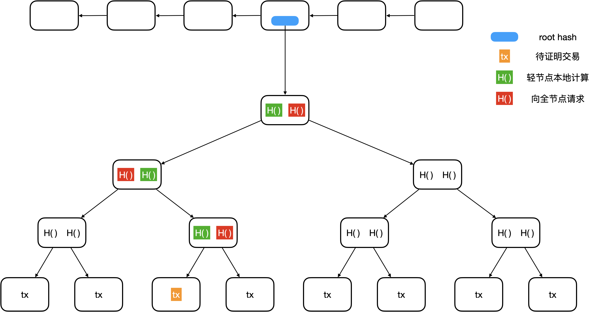
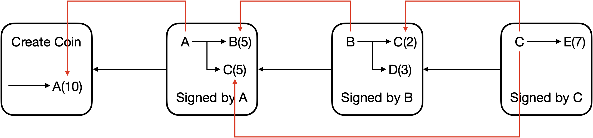
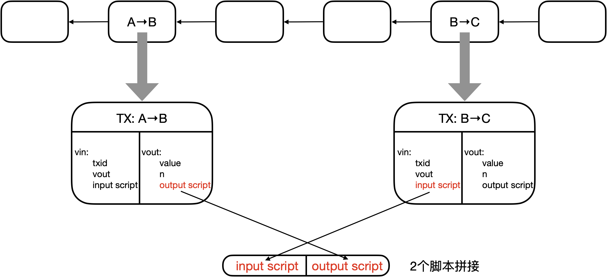
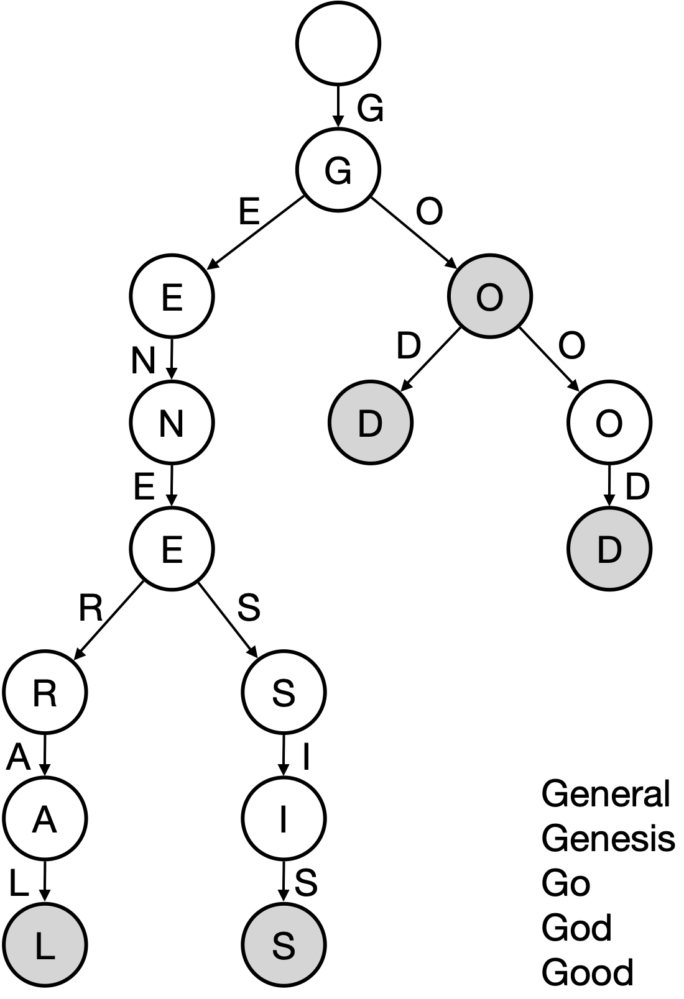
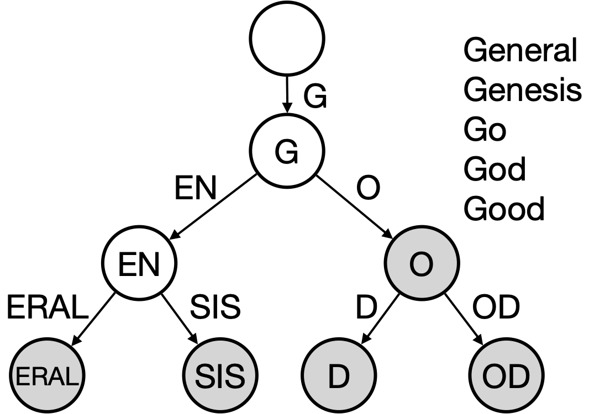
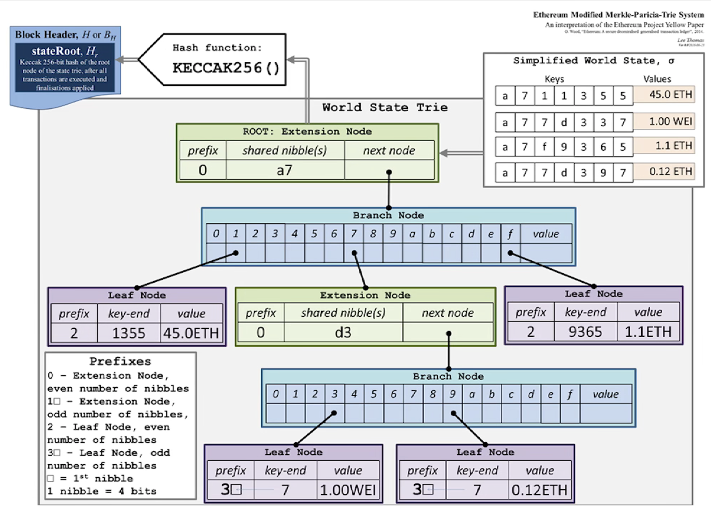
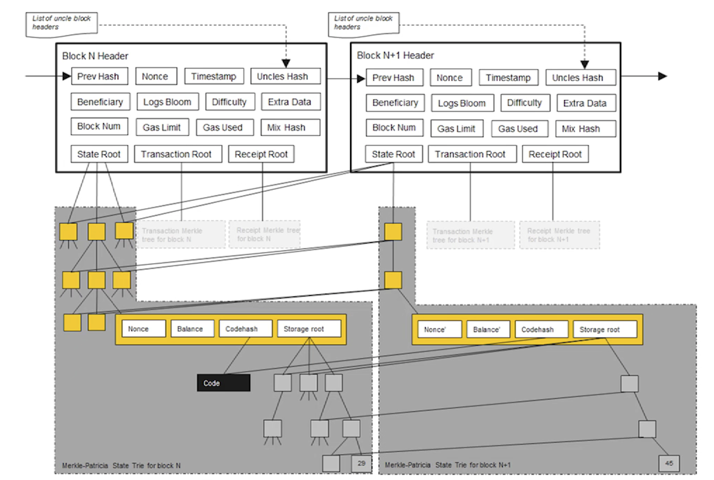
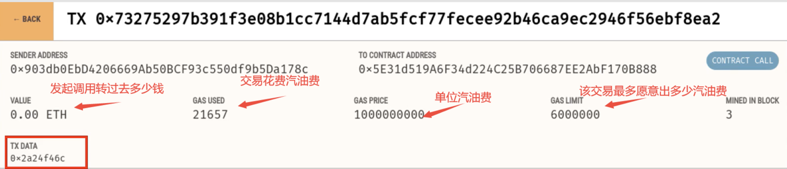

# Blockchain

推荐下载[Typora](https://typora.io/)本地查看

## BTC

### 密码学基础

BTC 主要使用了 Hash、签名

Hash 函数需要满足的3个性质

* collision resistance：抗碰撞

* hiding：难以从输出推断输入

* puzzle friendly：若需要得到特殊性质的输出(比如前面有k个0)，难以构造这样的输入

  * 挖矿的过程，即为不断寻找随机数nonce，使得
    $$
    H(block \ header(nonce))\le target
    $$

  * 因此挖矿的过程没有捷径，只有不断尝试不同的nonce，作为工作量证明

BTC 使用 SHA-256

### 数据结构

#### Hash Pointer

存储地址 + Hash 值(防篡改)

区块链是使用 Hash Pointer 的链表


链中任何内容的改动，都会造成最终(最右侧)哈希值的改动

节点中不必存取所有区块，倘若需要先前的区块，可向其它节点请求，通过比较哈希值，来确定请求得到的区块是正确的

#### Merkle Tree


树中任何内容的变化，都会引起 root hash 的变化

每一个叶节点，是一笔交易 (transaction，tx)

二叉树形式，查找效率更高

区块链中每一个区块包含了一棵 Merkle Tree


每一个 block header 包含所在树的 root hash，不包含任何交易信息

Merkle Tree 作用：

* 提供 Merkle proof：

  * 全节点：保存整个区块的内容

  * 轻节点：只包含 header (只包含 root hash) (比如手机上比特币钱包)

  * 如何向轻节点证明某一笔交易写入了区块链 (proof membership)：

    * 轻节点从下往上验证整条链的 Hash 值是否正确，即计算得到的 root hash 与已知的是否一致
    * 轻节点只有橙色 tx 信息，比如买家需要卖家向其证明交易发生了，由卖家提供红色H()，买家本地计算绿色H()
    * 验证的时间复杂度为 O(log(n))

    

  * proof non-membership：

    * 若 tx 没有特殊的排列顺序，则不存在高效的方法，即轻节点向全节点请求整棵树，验证的时间复杂度为 O(n)
    * 倘若使用 Sorted Merkle Tree，如叶节点按照 H() 排序
      * 计算需要验证的交易的 H()，寻找左右相邻的节点的 H()，若左右相邻的节点的 H() 到根节点验证正确，则说明需要验证的交易在两个节点之间，但是节点是相邻的，中间不存在其它节点，因此该交易不在区块中
      * 将验证的时间复杂度降低到 O(log(n))
      * BTC 中不使用此方法，因为通常不需要验证某一笔交易是否在区块中

### 协议

问题1：发行数字货币，倘若采用传统的私钥签名手段来保证货币的真实性，则可能遭遇 double spending attack (复制数字货币，传统的纸质货币难以复制)

问题2：每一张数字货币都有一个编号，发行方维护一张表，记录了每个编号的所有人，可以预防 double spending attack，这是中心化的解决方案

如何实现去中心化的解决方案？Blockchain！

|                        问题                         |               解决方案               |
| :-------------------------------------------------: | :----------------------------------: |
|       如何决定货币什么时候发行，该发行多少？        |                 挖矿                 |
| 如何保证交易的有效性，预防 double spending attack？ | 所有用户共同维护一种数据结构——区块链 |

一个简单的区块链：

* 图中两种箭头，一种为哈希链表连接区块，另一种用于说明币的来源，证明币不是凭空捏造的，而是有来源的，并防止 double spending attack



A 向 B 转账：

* 交易的输入：币的来源 + A的公钥，输出：B地址
* 每一笔交易的地址，是收方的公钥哈希后经过一系列运算得到
* 一般 A 无法查询得到 B 的公钥，需要 B 主动告知
* 所有节点都需要知道 A 的公钥，验证 A 的签名
  * 如何让所有节点都知道 A 的公钥：由 A 告知
    * 问题：倘若有人假冒 A，对外宣称假公钥，用对应的假私钥签名，这种情况会被查询币来源这一过程识破：例如第一步铸币过程的输出，会包含 A 的公钥的哈希，由此可判断发起交易方的公钥并不是声称的 A 的公钥

每一个区块包含很多交易，这些交易组成 Merkle Tree

区块的组成：

|             Block header              |    Block body    |
| :-----------------------------------: | :--------------: |
|                version                | transaction list |
| hash of previous block header (指针)  |                  |
|           Merkle root hash            |                  |
| target (挖矿的难度，目标阈值) (nBits) |                  |
|            nonce, 4 bytes             |                  |
|                 time                  |                  |

full node (全节点)：包含所有交易信息，验证每一笔交易

light node (轻节点)：只包含 block header，一般无法独立验证交易

* 一般不负责区块链的构造和维护
* 只是利用区块链的信息做一些查询等

> 本节讨论的是 full node

区块链实质为一个账本，如何保证各个节点的账本一致，即实现分布式共识 (distributed consensus)

* 分布式共识是一个重要的研究领域
  * 非常热门
  * 有很多不可能结论
    * 例如 FLP impossibility result：在一个异步系统 (网络传输时延没有上限) 中，即使只有一个成员是有问题的，也不可能取得共识
    * 例如 CAP Theorem：任何一个分布式系统，在 Consistency、Availability、Partition tolerance 中最多满足2个
  * 著名协议 Paxos，可以保证 Consistency

#### Consensus in BTC

假设恶意节点只占较少的一部分

假如某一个节点打包一个区块，决定是否放入链中，由各节点投票决定，则存在以下问题：

* membership：谁拥有投票权？联盟链可行，由大公司组成的联盟，hyperledger；BTC不行，谁都能生成账户，因此恶意节点可能产生很多账户，从而掌握投票控制权 (sybil attack)

BTC 也是采用投票，但不是基于账户，而是基于计算力：

* 每个节点都可以本地打包合法交易，生成候选区块，然后尝试各种 nonce 值，使得$H(block header)\le target$
* 定期调整挖矿难度，保证出块时间在 10min 左右
* 某个节点计算得到了 nonce，则获得了记账权，可发布区块
* 其它节点收到区块验证区块的合法性，比如 targets 是否满足难度要求，block header 的 Hash 是否满足要求，验证 body 中每一笔交易是否合法等等

是否验证通过就一定可以加入区块链？

* 虽然右下角的交易是合法的，但不能写入区块链
* longest valid chain，BTC 规定：接收的区块应该扩展最长合法链
* forking attack：在区块链中间插入区块，用于回滚已经发生的交易
* 正常情况下区块链也有可能发生分叉：
  * 两个节点几乎同时计算得到 nonce，发布区块，出现两个等长的分叉，该接收哪个？
    * 默认情况下接收最早收到的区块
    * 接下来，接收方沿着某一分叉延长区块链，则表明接收此分叉
    * 则一个分叉变为 longest valid chain，另一个分叉变为 orphan block，即被丢弃


block reward：

* coinbase transaction：铸币交易，发行新 BTC 的唯一方法
* 此交易不用指明币的来源
* 起初出块奖励为 50 BTC，每产生 21w 区块奖励减半 (出块时间 10mins，因此大概 4 年减半)

此共识机制要取得的共识是什么：去中心化账本的内容，获得记账权的节点才能获得此权利，如何获得此权利，算 nonce

* hash rate：每秒尝试 nonce 数，此值决定了投票的权重

此共识机制如何避免 sybil attack：

* 投票基于算力，而不是账户数目

### 实现

transaction-based ledger：BTC 基于交易的账本模式

* 转账交易、铸币交易
* 系统中不记录每个账户有多少钱，需要通过交易信息推算

full node 在内存中维护数据结构 UTXO：Unspent Transaction Output (还未花掉的交易输出)

* 一个交易可能有多个输出
* UTXO 组成：包含输出所在交易的 Hash 以及此输出是交易中的第几个输出
* 维护此数据结构的原因：为了检测 double spending，即检测新的交易是否合法，即检测要花掉的币是否在 UTXO 中
* 每个交易消耗掉一些输出，也产生新的输出

每一笔交易：total inputs = total outputs

* 输入也可能有多个，因此一笔交易可能包含多个签名
* 有些交易可能 total inputs 略大于 total outputs，差额作为交易费，给获得记账权发布区块的节点，吸引节点打包
  * 不然有些节点可能比较自私，只打包自己的交易
  * 这是 BTC 的第二种激励机制，是小费

account-based ledger：基于账户的模式，ETH 的实现方式

* 系统显式记录每一个账户的余额

如今挖矿激烈，挖矿难度设置较高，考虑到 nonce 为4字节，搜索空间仅为 2^32^，因此如今仅仅通过更改 nonce 满足 Hash 要求是不够的

* 还需要更改 Merkle root hash
* coinbase (铸币交易) 的值是不检查的，可以写入任意值，因此可以利用它来扩大搜索空间
* 挖矿程序一般两层循环，外层寻找 nonce，内层寻找 coinbase

每一笔交易：

* 拼接交易的输入脚本、币来源的输出脚本
* 倘若拼接顺利执行，则交易合法

挖矿每次尝试 nonce 可看作 Bernoulli trial：a random experiment with binary outcome

* 成功的概率 p 微乎其微
* 多次尝试实验，构成 Bernoulli process：a sequence of independent Bernoulli trials
* Bernoulli process 具有无记忆性 (memoryless)
* 需要尝试大量的 nonce 才能找到结果，这种情况下 Bernoulli process 可由 Poisson process 近似
* 概率上可推导出块时间服从 exponential distribution
* progress free：挖了 10 mins 没挖到，并不意味着快挖到了，而是还需要 10 mins 左右
  * 不然，算力强的矿工，会有不成比例的优势 (挖矿成功概率应该和算力成比例)
  * 尝试过的 nonce 越多，并不意味着下次 nonce 的成功概率越大，从而保证挖矿公平性


BTC 的总数：

* geometric series

$$
21w \times 50+21w\times 25 +21w\times 12.5+ ...=21w\times 50 \times (1+\frac{1}{2}+\frac{1}{4}+...)=2100w
$$

挖矿求解 puzzle 本身没有实际意义，但是挖矿过程对于维护区块链的安全性至关重要

Bitcoin is secured by mining!

虽然出矿奖励越来越少，因为 BTC 价格飙升，因此挖矿越来越激烈，此外后期激励主要来源于交易费

安全性分析 (假设算力主要掌握在诚实节点中)：

* 假如恶意节点 M 成功发布了区块

  * 能否将 A 的钱转给自己？不能，不知道 A 的私钥，无法伪造交易签名，诚实节点不接受此区块

  * M 能否 double spending?

    * forking attack，M 想要回滚交易，例如 M 支付比特币购买商品，商家发货，但是 M 回滚，不花钱得到了商品
    * 倘若正确的链较长，诚实节点都会往长链扩展，恶意节点想要逆转困难很大
    * 因此一种简单的防范此攻击的方法：多等几次 confirmation，BTC 中默认要等 6 个 confirmation
    * 经过 6 次 confirmation，才认为是不可篡改的 (1 hour)
    * Blockchain 被认为是不可篡改的账本 (irrevocable ledger)，由前分析可得这只是概率的保证，刚刚写入的内容相对容易被篡改

    

  * selfish mining：

    * 挖到一个区块不发布，继续挖，等到别人挖出了区块，可能已经挖到第二块了，一下子发布两块，因此浪费了别人的计算资源，减少了竞争
    * 风险较大，倘若挖到第一块不发布，别人发布的时候自己还未挖到第二块，此时赶紧发布第一块，被选中的概率就小了
    * 若没有非常非常强大的算力，不可能这么快挖出第二块，即使挖到了也有很大风险
    * selfish mining 可能用于 forking attack，但成功概率非常低

  * M 故意不把某些合法的交易写入区块链

    * 问题不大，总有诚实的节点会发布这些交易

### 网络

application layer：Bitcoin Blockchain

network layer：P2P Overlay Network

* 所有节点对等
* 加入网络需要联系 seed node，seed node 告知其已知的网络节点
* 节点间通过 TCP 通信，利于穿透防火墙
* 离开无需任何操作，其它节点一段时间内未收到消息，会删除该节点信息

设计原则：简单、鲁棒，而非高效 (非常耗带宽)

消息传播方式：flooding

* 收到消息后，转发给邻居节点
* 邻居节点不考虑拓扑结构
  * 牺牲的是效率，例如与身边节点转账和与美国节点转账的速率可能差不多

每个节点维护等待上链的交易的集合

* 第一次收到某条交易信息，将其加入集合，并转发 (前提是交易合法)
* 以后再收到此信息，则不再转发
* 节点收到新发布的区块，从集合中删去已经上链的交易 (或删去从新发布的区块中可以判断出来的集合中的非法交易)

新发布区块的传播方式与新交易的传播方式类似

* 验证区块的正确性，是否在最长合法链等信息
* 区块的传播更慢，为了不影响速率，限制区块的大小为 1 M

交易的传播方式：best effort

* 每一个节点并不一定能收到每一笔交易

### 挖矿难度

$$
H(block \ header(nonce))\le target
$$

调整挖矿难度，就是调整目标空间在整个输出空间中的比例

SHA-256：输出空间 2^256^

target：一般要求前面有多少个 0

挖矿难度与目标阈值 target 成反比：
$$
difficulty = \frac{difficulty\_1\_target}{target} \\
分子：难度系数为 1 时对应的target
$$
算力增强，挖矿难度降低，出块时间变短，交易马上可以上链，系统吞吐率高，是好事？

* 出块时间短，但是区块的传播有延时，分叉更容易出现，不利于系统共识
* 不利于系统安全性
  * 系统中总算力越高，则系统安全性更好，因为发动 51% attack 的代价越大
  * 51% attack：恶意节点掌握了 51% 算力，则容易发起各种攻击，比如 forking attack
    * 51% attack 是在两个分叉的情况下，恶意节点扩展恶意分叉，诚实节点扩展正确分叉
  * 6 个 confirmation 后，发起 forking attack 难度一般较大
    * 但是倘若有多个分叉，系统中的总算力被分散了
    * 诚实节点由于位置不同，选择扩展不同的分叉
    * 恶意节点集中控制某一分叉，因此攻击成功的可能性更高，不需要 51% 的算力要求

10 min 的出块时间是否最优，不一定？可讨论

* 有人认为支付确认 10 min 太长了

BTC 规定每隔 2016 区块，调整 target，大概 2 星期调整一次，调整公式：
$$
target=target\times \frac{actual\ time}{expected\ time}\\
actual\ time: time\ spent\ mining\ the\ last\ 2016\ blocks\\
expected\ time=2016\times 10\\
考虑到系统中存在的特殊情况，target变化最多不超过4倍
$$
如何让所有矿工都更改阈值：

* 代码硬编码
* 恶意节点若修改源码
  * 发布的区块不会被诚实节点认同

### 挖矿

全节点：

* 一直在线
* 在本地硬盘上维护完整的区块链信息
* 在内存里维护 UTXO 集合，以便快速检验交易的正确性
* 监听比特币网络上的交易信息，验证每个交易的合法性
* 决定哪些交易会被打包到区块里
  * 缺省情况下合法的交易、交易费符合要求就会被打包
* 监听别的矿工挖出来的区块，验证其合法性
  * 区块中的每个交易是否合法 (包括 coinbase tx)、发布的区块是否满足阈值要求，是否是延伸最长合法链等

* 挖矿
  * 决定沿着哪条链挖下去
  * 当出现等长的分叉的时候，选择哪一个分叉
    * 缺省情况选择最先听到的分叉

轻节点：

* 不是一直在线
* 不用保存整个区块链，只要保存每个区块的块头，大概差 1000 倍
* 不用保存全部交易，只保存与自己相关的交易
* 无法检验大多数交易的合法性，只能检验与自己相关的那些交易的合法性
* 无法检测网上发布的区块的正确性
  * 因为无法检测区块中包含的交易是否合法
* 可以验证挖矿的难度
* 只能检测哪个是最长链，不知道哪个是最长合法链

当一个节点正在挖，但收到别的节点已经挖出了区块，需要重新打包交易开始挖新的块，这样做是否比较可惜？

* memoryless
* 无论继续挖原来的，还是挖新的区块，成功的概率是一样的
* 不可惜

发布了合法的区块，并不一定胜利了，因为发布的区块不一定成为最长合法链

BTC 安全性保证：

* 密码学保证
* 共识机制

挖矿设备：

* 第一代：CPU
* 第二代：GPU，大规模并行计算 (矩阵乘法等)，GPU挖矿其实还是有点浪费
* 第三代：ASIC芯片，Application Specific Integration Circuit，对于不同的加密货币需要不同的特殊设计 (除非加密货币使用相同的 mining puzzle)

矿池：

* 把多个矿工组织起来，形成一个整体
* pool manager：矿主，负责全节点任务
  * 管理多个 miner，其只负责计算哈希值的任务
* 单个矿工收入不稳定，矿池提高收入稳定性
* 假如矿工是不同的个体，一旦有矿工挖到矿了，如何合理分红？
  * 亦可采用工作量证明的方式
  * 假如 target 需要 70 个 0，一旦 miner 算出 60 个 0 的块 (降低难度)，可作为 share (almost valid block) 发送给矿主
  * 一旦有 miner 挖到矿，矿主按照各个 miner 提交的 share 数分红
* 有没有可能 miner 挖到块，不提交给矿主，而自己偷偷发布
  * 不可能，每个矿工的任务由矿主发布
  * 矿主发布任务，可能不同的 coinbase 域分发给不同的 miner，由其计算哈希
  * coinbase 的地址是矿主的，miner 单独发布，也取不出钱
* miner 有没有可能捣乱，挖到 share 提交，挖到合法区块扔掉
  * 可能，但对于 miner 没有好处
  * 看似损人不利己，但可能是打击竞争对手
* 矿池的出现提升了 51% 攻击的可能
  * 矿主大幅降低管理费，吸引不明真相的矿工加入矿池
*  假如有矿池占据了 51% 算力，具体可发动以下攻击：
  * forking attack，能否发动攻击，本身就是概率问题
    * 比如 A → B，想回滚 A → A，一般等 6 个确认区块让 B 认为没事了，再发动攻击
    * 恶意节点发布区块，但是诚实节点发现区块并不在最长合法链中，因此不接受此区块，仍旧选择其它合法的区块延长最长合法链，但是恶意节点拥有更多算力，理论上它延长的链总会成为最长链，最终被诚实节点接受
  * Boycott：封锁，比如不想让账户 A 有关的交易上链，一旦有区块包含了 A，立刻计算产生不包含 A 的分叉
    * 这时候没必要等 6 个确认区块再发动攻击
    * 因为其他诚实用户不具备这么高的算力，倘若打包包含 A 的交易很可能是无用功，因此也会拒绝包含 A 的交易

### 脚本

比特币系统中使用的脚本语言非常简单，唯一可以访问的内存空间只有栈

```
交易结构
"result": {
	"txid": "...",							// 交易的ID
	"hash": "...",							// 交易的Hash
	"version": 1,								// 交易遵守的BTC协议版本
	"size": 226,								// 交易大小
	"locktime": 0,							// 设定交易生效时间，0表示立即生效
	"vin": [...],								// 交易输入部分
	"vout": [...],							// 交易输出部分
	"blockhash": 000000...,			// 交易所在区块哈希值
	"confirmations": 23,				// 已经有23次confirmations
	"time": ...,								// 交易产生时间
	"blocktime": ...						// 区块产生时间
}

交易的输入
// 输入为一个数组，此例中只有一个输入
// 如果存在一个交易有多个输入，那么每个输入都要说明币的来源并给出签名
"vin": [{
	"txid": "...",							// 之前交易的ID
	"vout": 0,									// 之前交易的第几个输出
	"scriptSig": {							// 输入脚本，即input script
		"asm": "...",
		"hex": "..."
	},
}]

交易的输出
"vout": [{
	"value": 0.2268400,					// 输出金额，单位是BTC
	"n": 0,											// 当前交易的第几个输出
	"scriptPubKey": {						// 输出脚本，即output script
		"asm": "...",
		"hex": "...",
		"reqSigs": 1,							// 输出需要多少个签名才可以兑现
		"type": "pubkeyhash",			// 输出的类型
		"address": [ "..." ]			// 输出的地址
	},{
		"value": 0.53756644,
    "n": 1,
    "scriptPubKey": {
      "asm": "...",
      "hex": "...",
      "reqSigs": 1,
      "type": "pubkeyhash",
      "address": [ "..." ]
	}
}]
```

脚本执行流程：



* 先执行input script，若无出错，再执行output script
* 如果脚本可以顺利执行，最终栈顶结果为true，则验证通过，交易合法
* 如果执行过程中出现任何错误，则交易非法
* 如果一个交易有多个输入脚本，则每个输入脚本都要和对应的输出脚本匹配执行，全部验证通过才能说明该交易合法

输入输出脚本形式1——P2PK（Pay to Public Key）

* 输出脚本直接给出收款人公钥

```
input script:
	PUSHDATA(Sig)
output script:
	PUSHDATA(PubKey)
	CHECKSIG

执行过程
	1. 签名压栈
	2. 公钥压栈
	3. 弹出2个元素，用公钥检查签名正确性，正确则返回true
```

输入输出脚本形式2——P2PKH（Pay to Public Key Hash）——最常用

* 输出脚本不直接给出收款人公钥，而是公钥的哈希

```
input script:
	PUSHDATA(Sig)
	PUSHDATA(PubKey)
output script:
	DUP
	HASH160
	PUSHDATA(PubKeyHash)
	EQUALVERIFY
	CHECKSIG
	
执行过程
	1. 签名压栈
	2. 公钥压栈
	3. 栈顶元素复制一遍
	4. 栈顶元素弹出取哈希，哈希值压栈
	5. 输出脚本提供的公钥哈希值压栈
	6. 弹出栈顶2个元素，比较是否相等
	7. 用公钥检查签名是否正确，正确则返回true
```

输入输出脚本形式3——P2SH（Pay to Script Hash）——最常用

* 输出脚本给出的不是收款人公钥的哈希，而是收款人提供的一个脚本的哈希
* 该脚本称为 redeemScript
* 等未来花钱的时候，输入脚本要给出 redeemScript 的具体内容以及可以使之正确运行需要的签名

```
input script:
	...
	PUSHDATA(Sig)
	...
	PUSHDATA(serialized redeemScript)
output script:
	HASH160
	PUSHDATA(redeemScriptHash)
	EQUAL
	
验证过程:
	1. 验证序列化的redeemScript是否与output script中哈希值匹配
	2. 反序列化并执行redeemScript，验证intput script中给出签名是否正确

redeemScript的形式:
	1. P2PK形式
	2. P2PKH形式
	3. 多重签名形式

实例:
	redeemScript:
		PUSHDATA(PubKey)
		CHECKSIG
  input script:
    PUSHDATA(Sig)
    PUSHDATA(serialized redeemScript)
  output script:
    HASH160
    PUSHDATA(redeemScriptHash)
    EQUAL
    
	执行过程:
		1. 输入脚本签名入栈
		2. redeemScript入栈
		3. 栈顶元素去哈希
		4. redeemScriptHash入栈
		5. 比较栈顶元素是否相等，若相等则都出栈
		a. PubKey入栈
		b. 用CHECKSIG验证输入脚本给出的签名正确性
		
第一阶段执行拼接后的输入和输出脚本
 (反序列化操作并未展现，因为需要每个节点自己执行)
```

> 为何要如此复杂？
> 针对此例，这样做确实复杂了。在BTC系统中起初并没有P2SH，后通过软分叉加入了这个功能。实际上，该功能的常见应用场景是对多重签名的支持。
> 在BTC系统中，一个输出可能需要多个签名才能取出钱来。例如，对于公司账户，可能会要求5个合伙人中任意3个的签名才能取走钱，这样便为私钥泄露和丢失提供了一定程度的保护。

多重签名：

* 最早的方法：通过CHECKMULTISIG来实现

  * 输入脚本提供N个签名，输出脚本给出N个公钥和阈值M
  * N个人至少有M个签名即可实现转账(N>=M)
  * 输入脚本只需要提供N个公钥中M个合法签名即可
  * 给出的M个签名顺序要和N个公钥中相对顺序一致

  ```
  input script:
  	x												// CHECKMULTISIG实现存在bug，多压入一个无用元素来解决
  	PUSHDATA(Sig_1)
    PUSHDATA(Sig_2)
    ...
    PUSHDATA(Sig_M)
  output script:
  	M												// 阈值
    PUSHDATA(pubkey_1)
    PUSHDATA(pubkey_2)
    ...
    PUSHDATA(pubkey_N)
    N
    CHECKMULTISIG
  ```

  * 这是早期的多重签名，在应用中体现出了一些问题
  * 网购时，某个电商使用多重签名，要求5个合伙人中任意3个签名才能将钱取出
  * 这就要求用户在生成转账交易时，要给出5个合伙人的转账公钥以及N、M的值
  * 对于用户来说，需要购物网站发布才能知道这些信息
  * 不同电商对于数量要求不一致，会为用户转账交易带来不便，因为这些复杂性暴露给了用户
  * 为了解决这一问题，需P2SH

* 使用P2SH实现多重签名

  * 本质上是将复杂度从输出脚本转移到输入脚本
  * 收款人只需要公布赎回脚本哈希值即可，用户只要在输出脚本中包含该哈希值，用户无需知道收款人的相关规则，对用户更加友好

  ```
  redeemScript:
  	M
    PUSHDATA(pubkey_1)
    PUSHDATA(pubkey_2)
    ...
    PUSHDATA(pubkey_N)
    N
    CHECKMULTISIG
  input script:
    x
  	PUSHDATA(Sig_1)
    PUSHDATA(Sig_2)
    ...
    PUSHDATA(Sig_M)
    PUSHDATA(serialized redeemScript)
  output script:
  	HASH160
  	PUSHDATA(redeemScriptHash)
  	EQUAL
  	
  执行过程:
  	1. 将为解决CHECKMULTISIG引入的bug而添加的无用元素压栈
  	2. M个签名压栈
  	3. 将序列化的redeemScript压栈
  	4. 栈顶redeemScript取哈希
  	5. 输出脚本提供的redeemScriptHash压栈
  	6. 判断两个哈希值是否相等
  	a. M压栈
  	b. N个公钥和N压栈
  	c. 检查多重签名正确性
  ```

特殊脚本：

* 以RETURN开始，后面可以跟任何内容
* 无条件返回错误，所以该脚本永远不可能通过验证
* 执行到RETURN，后续操作不会再执行
* 该方法是销毁比特币的一种方法

```
output script:
	RETURN [zero or more ops or text]
	
假如有一个交易的input指向这个output，不论input里的input script如何设计，执行到RETURN命令之后都会直接返回false，不会执行RETURN后面的其它指令，所以这个output无法再被花出去，其对应的UTXO也就可以被剪枝了，无需保存
```

* 为什么要销毁比特币
  * 部分小币种(AltCoin)要求销毁部分比特币才能得到该种小币种
    * 例如，销毁一个BTC可以得到1000个小币
    * 使用这种方法证明付出了一定代价，才能得到小币种
  * 往区块链中写入内容
    * 区块链是不可篡改的账本，有人便利用该特性往其中添加想要永久保存的内容
    * 例如：股票预测情况的哈希、知识产权保护
    * 在铸币交易中，有一个CoinBase域，其中可以写入任何内容，而且这种方法不需要销毁BTC，可以直接写入，为什么不使用这种方法
      * 这种方法只有获得记账权的节点才可以写入内容，而上面的方法可以保证任何一个BTC系统中的节点都可以向区块链写入内容
    * 实际上，很多交易并未销毁BTC，而是支付了交易费

### 分叉

形成的原因：

* state fork——对比特币系统当前状态产生分歧导致的分叉，例如挖矿时两个节点差不多同时挖出矿，都会发布区块
* forking attack——分叉攻击
* protocal fork——比特币协议改变，在分布式系统中不能保证所有节点同时升级软件，假设存在少数节点未升级，导致出现分叉
  * 硬分叉
  * 软分叉

#### hard fork

扩展比特币协议新功能，未升级软件的旧节点可能会不认可这些修改，因此对比特币协议内容产生分歧，从而导致分叉

BTC系统中一个区块最大为1MB，平均每秒7笔交易，吞吐率低，因此有人认为可以增大区块大小，例如从1MB增大至4MB

* 假设新节点认为区块大小最大4MB，旧节点认为区块大小最大1MB，且新节点占据大多数

  

* 假设①为当前区块链，此时软件更新，有一个新节点挖出了一个区块如②

* 对于旧节点来说，该区块为一个非法区块，旧节点不会对其认可，因此旧节点仍然从其前一个区块开始挖矿，如③

* 旧节点挖出的区块，新节点是认可的(并未超过4MB限制)，所以对旧节点来说，③下面的链才是合法链，而对新节点来说，这两条链都是合法的链

* 因为新节点算力强，所以出现④情况可能性更大，对于新节点来说，上面的为最长合法链，新节点沿着上面的链继续挖

* 对于旧节点来说，上面的链无论多么长，都是一条非法链，所以旧节点沿着下面的链继续挖

* 新节点永远沿着上面的链挖，旧节点永远沿着下面的链挖，由于新节点算力强，所以形成两条永远都在延伸且平行的链

* 这种分叉是持久性的

* 只要这部分旧节点永远不更新软件，下面的链便永远不会消失

* 只有系统中所有节点更新软件，才不会产生永久性分叉

出现hard fork后，形成两条平行链，意味着社区分裂，有人认为下面的链才是正统，各个链上的货币独立

> 以太坊称为ETH，但目前看到的ETH已经不是最初的ETH了，以太坊在历史上发生过硬分叉，另一个链称为ETC。实际上，ETC才是以太坊原本的协议，而ETH是黑客攻击ETH上一个智能合约THE DAO后进行回滚的协议链(将黑客攻击偷取的以太币采用硬分叉方式回滚到另一智能合约，然后退还给真正拥有者)。
> 由于有人不愿意这么做，因此这次硬分叉造成了以太坊社区的分裂。虽然ETC不如ETH有名，但它也是目前一种主流货币。
> 由于两个链分叉造成了相互影响，产生了很多麻烦。比如：在ETH链上有一笔转账B->C，有人便在ETC链上回放，将ETC链上的货币也转给了C(C收到两笔钱)。后来，对两条链各添加了一个chainID，才使得这两条链真正分开。

#### soft fork

如果对BTC协议添加限制，使得原本合法交易在新交易中不合法，便会形成软分叉

> 区块链中区块大小调整并非简单修改一个参数，调整大小很有可能引发分叉，由于参数修改方式不同，有可能是硬分叉，也有可能是软分叉。

假设将区块大小从1MB减小至0.5MB：

* 新节点认为区块大小最大0.5MB，旧节点认为区块大小最大1MB，且新节点占据大多数

  

* 假设①为当前区块链，此时软件更新，有一个新节点挖出了一个区块如②

* 对于旧节点来说，该区块符合1MB大小限制，旧节点对其认可，从而旧节点会沿着该新的小区块开始挖，如③

* 但是新节点会认为该旧节点挖出区块超过0.5MB限制，不会认可该区块，会从前一个小区块开始挖，如④

* 旧节点认可新区块，最终会造成⑤中的效果，旧节点挖出的区块一直被抛弃，无法得到出块奖励(不在最长合法链上)

* 这就倒逼旧节点升级软件，最终会实现区块链上的所有矿工共同认可新协议，实现软件协议的升级

* 需要注意的是，旧节点如果不升级软件，挖出的区块可能就白挖了(大于0.5MB)

* 只要系统中拥有半数以上算力的节点更新软件，就不会产生永久性分叉

系统中可能出现软分叉的情况及其实例：

* 给某些目前协议中未规定的域赋予新的含义或规则
  * 目前UTXO是全节点自己在本地为了方便查询自行维护的，但UTXO内容并未写入区块链
  * 轻节点如果查询某账户余额，便需要询问全节点，全节点根据UTXO中信息可以计算得到账户余额，但如何确保全节点提供了正确数据？
    * 在coinbase域中可以写入任何内容，前8个字节作为extra nonce，后面还剩下很多空间，有人提出利用剩余空间存储UTXO集合的根哈希值
    * 可以对比Merkle Proof
  * 由于直接修改block header会造成硬分叉，有人便提出了以上方案
  * 可以看到，旧节点认可新节点的区块，但新节点对于旧节点coinbase域检查时发现并没有UTXO的根哈希值，不会认可其发布的区块，所以这是软分叉
* P2SH
  * 起初比特币协议中无此功能，后通过软分叉加入

### QA

> 转账交易时，如果接收者不在线(没有连在比特币网络上)怎么办

转账交易只需要在区块链上记录，将某账户比特币转到另一账户，因此只需知道接收方地址，接收方是否在线无影响

> 假设某全节点收到一个转账交易，是否有可能此前从未收到过转账交易中的收款人地址

可能，因为比特币账户只需要本地产生，只有该账户第一次收到钱，其它节点才能知道该节点的存在

> 如果账户私钥丢失怎么办

没有办法，因为比特币是去中心化货币，没有第三方中心机构可以重置密码，所以账户上的钱也就变成了死钱

加密货币交易所(中心化机构)，一般需要提供身份证明，如果忘记私钥可以找交易所申请追回私钥。但目前这类货币的交易所，处于缺少监管的状态，并不一定具有可信力。而且，其本身仅起到“中介”作用，与该提问的回答“私钥丢失无法追回里面的比特币”并不冲突

> 私钥泄露怎么办

尽快将剩余BTC转到其它安全账户上，没有第三方中心机构重置密码或冻结账户，只能自己对自己负责

> 转账写错地址怎么办

没有办法，因为无法取消已经发布的交易。如果转入地址为假，则该部分比特币便成为了死钱。但是，比特币系统中UTXO会永久保存该交易，因此对全节点不友好

> 之前在BTC脚本中介绍了OP_RETURN指令，这种方法使得普通用户能够向比特币网络写入想要一直保存的内容。但OP_RETURN执行结果是无条件返回错误，而交易返回错误，区块又怎么会包含它，区块链又如何会接收这个区块

OP_RETURN实际写在当前交易的输出脚本中，而验证交易合法性时，使用的是当前交易的输入脚本和前一个交易(币来源的交易)的输出脚本。也就是说，验证当前交易合法性时，并不会执行该语句。只有在有人想花这笔钱时，才会执行该语句

> BTC系统挖矿，会不会有矿工“偷”答案，例如某个矿工发现其它矿工发布了nonce，收到后验证该区块是否合法，将该nonce作为自己找到的nonce发布出去

这是不可能的。发布的区块中包含铸币交易，其收款人地址为挖到矿的矿工地址，如果要偷答案，需要修改该收款地址，而地址改变，铸币交易内容也发生改变，从而引发Merkle Tree根哈希值改变，从而导致原本的nonce作废

> 交易费是交易者为了自己交易可以上链而给出的“小费”，那么如何得知哪个矿工可以挖到矿

事先无需知道谁会挖到矿，交易中总输入和总输出差额就是交易费，哪个矿工挖到矿，在打包交易时，可以将这些交易费收集起来作为自己获得的交易费

### 匿名性

BTC并不具有很好的匿名性

#### 匿名性分析

虽然用户可以生成多个地址账户，但这些地址账户可以被关联起来：

* 表面上每次交易可以更换公私钥对，从而每次都是新的账户，具有很强的匿名性，但实际上这些账户在一定情况下是可以被关联起来的


* 该交易有2个输入、2个输出，所以addr1和addr2很可能是同一个人所持有的账户，因为此人同时拥有这两个私钥的地址(一个账户中的钱可能不够)
* 在输出中，有一个地址很有可能是属于找零钱的地址，即花掉之后剩余的钱，在某些情况下可以辨别出这一输出地址

地址账户与个人在真实社会中的身份可能会产生关联：

* 任何使得BTC和实体世界中关联的操作都有可能泄露用户真实身份
  * 例如资金的转入转出，使用现实中的货币购买BTC，或将BTC转为现实中的货币
* 为了防止洗钱，司法金融机构会对大额资金转入BTC或大量BTC转为现实货币的行为进行监管

使用BTC日常支付可能泄露信息：

* 例如某些商家接受使用BTC进行支付，支付人和其BTC账户建立了实体联系，从而会泄露个人信息

如何提供匿名性：

* coin mixing：从应用层看，可以将各个不同用户的BTC混合在一起，使追查变得混乱
* 从网络层看，可以采用多路径转发的方法

#### 零知识证明

定义：一方(证明者)向另一方(验证者)证明某一个陈述是正确的，但不需要透露除该陈述是正确的之外的任何信息

零知识证明的数学基础是同态隐藏：

* 如果x、y不同，那么它们的加密函数值E(x)、E(y)不同
  * 无碰撞：如果有E(X)=E(y)，则必然有x=y
* 给定E(x)的值，很难反推出x的值
  * 加密函数不可逆
* 给定E(x)、E(y)的值，可以很容易计算出某些关于x、y的加密函数值
  * 同态加法：通过E(x)、E(y)计算出E(x+y)的值
  * 同态乘法：通过E(x)、E(y)计算出E(xy)的值
  * 扩展到多项式

> A向B证明自己知道一组数x、y使得x+y=7，同时不让B知道x、y的具体数值
>
> 1. A将E(x)、E(y)发给B
> 2. B收到E(x)、E(y)，计算E(x+y)
> 3. B验证E(x+y)与E(7)是否相等，相等则验证通过

盲签：

* 特殊的数字签名技术，签名者对消息内容不可见，签名被公开后签名者不能追踪签名
* 电子交易中，交易信息依赖于银行等第三方机构。第三方机构需要防范double spending等，需要对电子货币进行签名。签名的过程中，第三方机构必然会了解到交易内容。如果想要第三方机构负责相应工作，但不知道交易具体内容，就可以采用盲签的方法

零币和零钞——专门为匿名性设计的货币：

* 零币和零钞在协议层混合了匿名化处理，其匿名属性来自密码学保证
* 零币系统中存在基础币和零币，通过基础币和零币的来回转换，消除旧地址和新地址的关联性，其原理类似于混币服务
* 零钞系统使用zk-SNARKs协议，不依赖一种基础币，区块链只记录交易的存在性和矿工用来验证系统正常运行所需要关键属性的证明，区块链上既不显示交易地址也不显示交易金额，所有交易通过零知识验证的方式进行
* 花费零币时，只需用零知识证明来证明花掉的币是系统中存在的某一合法的币，但不用透露具体花掉的是系统中哪一个币，因此破坏了关联性
* 从数学上看，零币和零钞是安全的，但其并不是百分之百的匿名，其并未解决与系统外部实体发生交互时对匿名性的破坏

### 思考

哈希指针：

* 所谓哈希指针，只有哈希没有指针
* 全节点一般将区块存储于一个key-value数据库中，key为哈希，value为区块内容，常用的key-value数据库为levelDB
* 只要掌握最后一个区块的哈希值即可依据哈希值一直往前找到区块链所有内容

区块“恋”：

* 将私钥分为N份，N个人分别保存，这种做法存在一系列问题：
  * 如果N个人中任意一个人忘记私钥，则无法将钱取出
  * 截断私钥长度，会降低安全性，因为私钥长度直接影响破解难度
  * 该钱可能变成死钱，一直保存在UTXO集合中，对矿工不友好

分布式共识：

* 之前有提及，理论上来说，分布式系统不可能达成共识
* 严格来说，BTC系统随时可能被推翻，例如分叉攻击导致系统回滚
* 然而理论和实际存在差异，不可能结论只是针对特定模型，实际中对模型稍微修改或添加线下方法即可将不可能变为可能

稀缺性：

* 总量固定的东西并不适合作为货币，这也就决定了BTC在未来并不能完全颠覆现有货币体系

量子计算：

* 量子计算离使用有很长距离
* 对传统金融业的破坏更大
* 地址为公钥哈希，难以通过哈希确定公钥，因此即使量子计算也难以反推私钥

## ETH

### 概述

BTC和ETH为最主要的两种加密货币，BTC称为区块链1.0，以太坊称为区块链2.0

ETH为Vitalik Buterin受到BTC启发发明出来的”下一代加密货币与去中心化应用平台“

BTC中货币最小单位为“聪”，最少的钱为一聪；ETH中货币最小单位为“Wei”，最少的钱为一Wei

针对比特币设计中存在的某些不足，以太坊对其进行了改进，例如出块时间、共识协议、mining puzzle

* mining puzzle对内存要求高，以应对ASIC芯片的广泛使用

未来，以太坊将会用权益证明(POS)替代工作量证明(POW)

以太坊增加了对智能合约的支持：

* BTC本身是一个去中心化的货币，在比特币取得成功之后，很多人开始思考：除了货币可以去中心化，还有什么可以去中心化？
* 以太坊的一个特性就是增加了对去中心化的合约的支持
* 如果说比特币系统本身是一个货币应用，以太坊则由于智能合约，升级成为了一个平台，用户可以依据该平台自行开发业务应用
* 货币本身由政府发行，由政府公信力为其背书，BTC通过技术手段取代了政府的职能。现实生活中经常提到“契约”或“合约”，合约的有效性也需要政府进行维护，如果产生纠纷需要针对合同合法性进行判决
* ETH的设计目的就是通过技术手段取代政府对于合约的职能
* 去中心化合约的优点：例如，若合同签署方并非在同一国家，没有统一的司法部门，此时如果可以编写无法修改的合约，所有人就无法违约
* 需要注意的是，并非所有的合约，都可以通过代码实现

### 账户

BTC系统是基于交易的账本，系统中未显式记录账户有多少钱，只能通过UTXO进行推算

* A转给B钱，需要说明币的来源
* 账户中的钱在花的时候，必须一次性全部花出去


* B收到A的10个BTC，想给C转3个BTC，如果按照①中的方式，其余7个BTC会作为交易费给挖出区块的矿工
* 为了避免这种情况，需采用②中的方式，将3个BTC转给C，将剩余7个BTC转给自己的另一账户

ETH系统采用了基于账户的模型，与现实中银行账户相似：

* 系统中显式记录每个账户以太币的剩余数量
* 转账是否合法只需要查看转账者账户中以太币是否足够即可，天然地防范了双花攻击
* 不需要每次全部转账

以太坊这种模式存在重放攻击的缺陷：

* 重放攻击：A向B转账，过一段时间，B将A的交易重新发布，导致A账户再一次被扣钱
* 重放攻击与双花攻击是相对的，对于一笔交易A→B，重放攻击是B发起的，双花攻击是A发起的
* 为了防范重放攻击，ETH给每一个账户添加计数器nonce
  * nonce记录该账户交易过多少次，每一次交易就加一
  * 每一笔交易包含了nonce (在签名范围中)
  * 系统中全节点维护账户余额和该账户的计数器，防止本地账户篡改余额或进行重放攻击

以太坊系统中存在两类账户：外部账户、合约账户

* 外部账户：类似于BTC系统中公私钥对，包含账户余额balance、计数器nonce
* 合约账户：不通过公私钥对控制
  * 不能主动发起交易
  * 只能接收外部账户调用，之后才能发起交易或调用其它合约账户
  * 包含balance、nonce、code(代码)、storage(相关状态—存储)
  * 创建合约会返回一个地址，通过地址就可以对其调用
  * 调用过程中，代码不变但状态会发生变化

> 为什么ETH设计了基于账户的模型而不是沿袭BTC系统

* BTC系统隐私保护较好，每次交易都可以换一个新的账户
* 以太坊支持智能合约，对于合约来说，要求参与者有比较稳定的身份
* 有人提出使用合约实现一些金融衍生品 (financial derivative)，例如往合约里投钱，预测期货未来价格走势，如果预测准确则返钱，如果投完钱账户地址变了，就没法返钱了

### 数据结构

在以太坊中，有3棵树，分别是状态树、收据树和交易树

以太坊实现的是"平台性"的应用，复杂性较高

#### 状态树

首先，要实现从账户地址到账户状态的映射

* 在以太坊中，账户地址为160位，表示为40个16进制数
* 状态包含了余额(balance)、交易次数(nonce)，合约账户中还包含了code(代码)、存储(stroge)
* 其本质上为key-value键值对，所以直观想法便用哈希表实现，若不考虑哈希碰撞，查询效率为常数级别，但采用哈希表，难以提供Merkle Proof

在BTC和以太坊中，交易保存在区块内部，一个区块可以包含多个交易，通过区块构成区块链，而非交易

> 能否像BTC中，将哈希表的内容组织为Merkle Tree

* 当新区块发布时，哈希表内容会改变，每当产生新区块(ETH中新区块产生时间为10s左右)，都要重新组织Merkle Tree，明显不现实
* 比特币系统中没有账户概念，交易由区块管理，而区块包含的交易上限为4000个左右，所以Merkle Tree不是无限增大的，而ETH中，Merkle Tree用来组织账户信息，因此会越来越庞大
* 实际中，发生变化的仅仅为很少一部分数据，每次重新构建Merkle Tree代价很大

> 倘若不使用哈希表，直接使用Merkle Tree，每次修改只需要修改其中一部分，是否可行

* 实际中，Merkle Tree并未提供一个高效的查找和更新的方案
* 此外，将所有账户构建为一个大的Merkle Tree，为了保证所有节点的一致性和查找速度，必须进行排序
  * 假如每个节点不维护一致的Merkle Tree，则可以把组成Merkle Tree的账户信息写入区块链，但是由于其信息量大(相对于交易信息)、区块生成速度快、账户状态改变少，这种做法不现实

> 经过排序，使用Sorted Merkle Tree是否可行

* 新增账户，由于其地址随机，插入Merkle Tree时很可能在Tree中间，因此其必须进行重构
* Sorted Merkle Tree插入的代价太大  

> BTC系统中，虽然每个节点构建的Merkle Tree不一致 (不排序)，但最终获得记账权的节点的Merkle Tree才是有效的

以太坊采用的数据结构：MPT

一种简单的数据结构——trie (字典树、前缀树)



* 图中只画出了key，没有画出value
* trie中每个节点的分支数目取决于key值的取值范围 (图中最多26个英文字母+一个结束标志位)
* trie查找效率取决于key的长度，实际应用中以太坊地址长度为160位
  * 以太坊key16进制表示，0~f
* 理论上哈希会出现碰撞，而trie不会发生碰撞
* 给定输入，无论按照什么顺序插入，构造的trie都是一样的
* 更新操作局部性较好
* trie缺点：存储浪费，很多节点只存储一个key值，但其“儿子”只有一个

进行了路径压缩的trie——Patricia trie



* 如果新插入单词，原本压缩的路径可能需要扩展
* 树中插入的键值分布较为稀疏的情况下，路径压缩效果较好
* 在以太坊系统中，160位的地址存在2^160^种，该数非常大，和账户数目相比，可以认为地址这一键值非常稀疏
  * 地址这么大，是为了防碰撞
* 以太坊使用的并非简单的PT(Patricia Tree)，而是MPT(Merkle Patricia Tree)

Merkle Tree 和 Binary Tree：

* 区块链和链表的区别：区块链使用哈希指针，链表使用普通指针
* Merkle Tree 相比 Binary Tree，也是将普通指针换成了哈希指针

以太坊系统中，将所有账户组织为一个经过路径压缩和排序的Merkle Tree，其根哈希值存储于block header中

* BTC系统中只有一个交易组成的Merkle Tree，而以太坊中有三棵树，因此在以太坊的block header中存有三个根哈希值

根哈希值的用处：

* 防篡改
* 提供Merkle Proof，可以证明账户余额，轻节点可以进行验证
* 证明某个发生了交易的账户是否存在
* 保证全节点的一致性

以太坊中针对MPT(Merkle Patricia tree)进行了修改，称之为Modified MPT



* 简单化，右上角4个账户，7Bytes地址，账户状态显示余额
* Extension Node：路径压缩节点
* Branch Node：分支节点
* 图中的指针都是哈希指针

每次发布新区块，状态树中部分节点状态会改变

* 改变并非在原地修改，而是新建一些分支，保留原本状态
* 如下图中，仅仅有新发生改变的节点才需要修改，其它未修改节点直接指向前一个区块中的对应节点



* 以太坊中合约账户的storage也是以MPT的形式存储
  * 因此以太坊大MPT包含小MPT
* 系统中全节点并非维护一棵MPT，而是每次发布新区块都要新建MPT，只不过大部分节点共享

> 为何保留历史状态，不在原地直接修改


* 为了便于回滚，如①中产生分叉，而后上面节点胜出，变为②中状态
* 之前接收了下面区块的节点，需要将状态进行回滚，因此需要维护这些历史记录
  * 在BTC中，由于交易类型简单，可以通过反向操作推算出前面的状态，不需要维护历史记录
    * 例如A→B (10BTC)，只需A账户增加10BTC，B账户减少10BTC即可完成回滚
  * ETH中存在智能合约 (图灵完备，可实现各种功能)，执行完智能合约后想要推算出之前的状态，几乎不可能
  * 因此要支持回滚，必须保存之前的历史状态

```
type Header struct {
	ParentHash				// 父区块的哈希(前一个区块的哈希值)
	UncleHash					// 叔父区块的哈希
	Coinbase					// 矿工地址
	Root							// 状态树根哈希
	TxHash						// 交易树根哈希
	ReceiptHash				// 收据树根哈希
	Bloom							// 布隆过滤器(用于查询，和收据树相关)
	Diffculty					// 挖矿难度
	Number
	GasLimit					// 汽油费相关
	GasUsed						// 汽油费相关
	Time							// 区块大致产生时间
	Extra
	MixDigest					// 和挖矿过程相关
	Nonce							// 和挖矿过程相关
}

type Block struct {
	header				*Header					// 指向block header的指针
	uncles				[]*Header				// 指向叔父区块的指针
	transactions	Transactions		// 交易列表
	
	...
}

// 区块在网上真正发布时的信息
type extblock struct {
	Header				*Header
	Txs						[]*Transaction
	Uncles				[]*Header
}
```

状态树中保存了key-value对，key就是地址，而value是账户状态，其通过RLP编码后存储

* RLP：Recursive Length Prefix，一种进行序列化的方法

#### 交易树&收据树

每次发布一个区块时，区块中的交易会形成一棵Merkle Tree，即交易树

ETH添加了一棵收据树，每个交易执行完之后形成一个收据，记录交易相关信息

交易树和收据树上的节点是一一对应的

由于以太坊智能合约执行较为复杂，通过增加收据树，可以快速查询执行结果

交易树和收据树都是M(Merkle)PT，而BTC中都采用普通的MT(Merkle Tree)：

* 可能仅仅是为了三棵树代码复用所以这样设计

MPT的好处是支持查找操作，通过键值沿着树进行查找即可：

* 对于状态树，查找键值为账户地址
* 对于交易树和收据树，查找键值为交易在发布的区块中的序号

交易树和收据树只将当前区块中的交易组织起来，而状态树将所有账户的状态都包含进去，无论这些账户与当前区块中交易有无关系

多个区块状态树共享节点，而交易树和收据树依照区块独立

交易树和收据树的用途：

* 向轻节点提供Merkle Proof
* 更加复杂的查找查询
  * 例如查询过去十天与某一智能合约有关的交易、过去十天的众筹事件等

##### Bloom Filter (布隆过滤器)

支持较为高效查找某个元素是否在某个集合中

暴力方法：元素遍历，复杂度为O(n)——轻节点不能用(没有交易列表，即集合元素信息)

Bloom Filter方法：给一个大的集合，计算出一个紧凑的“摘要”

> 给定一个数据集，其中含元素a、b、c，通过一个哈希函数H()对其进行计算，将其映射到一个其初始全为0的128位的向量的某个位置，将该位置置为1
>
> 将所有元素处理完，就可以得到一个向量，称该向量为原集合的“摘要”，可见该“摘要”比原集合小很多
>
> 假定想要查询一个元素d是否在集合中，假设H(d)映射到向量中的位置处为0，说明d一定不在集合中；假设H(d)映射到向量中的位置处为1，有可能集合中确实有d，也有可能因为哈希碰撞产生误报
> 

Bloom Filter特点：有可能出现误报，但不会出现漏报

Bloom Filter变种：采用一组哈希函数进行向量映射，有效避免哈希碰撞

如何删除集合中的元素？

* 无法操作，简单的Bloom Filter不支持删除操作
* 如果想要支持删除操作，需要将记录数修改为一个计数器(需要考虑计数器是否会溢出) 

ETH每个交易完成后会产生一个收据，包含一个Bloom Filter记录交易类型、地址等信息

在区块block header中也包含一个Bloom Filter，其为该区块中所有交易的Bloom Filter的并集

查找时先查找块头中的Bloom Filter，如果块头中包含，再查看区块中包含的交易所对应的收据树的Bloom Filter，如果存在，再查看交易进行确认，如果不存在，则说明发生了“碰撞” (误报)

* 通过Bloom Filter，可以快速过滤掉无关区块

以太坊的运行过程，可以视为交易驱动的状态机

* 状态是指所有账户的状态，交易是指每次发布的区块中的交易
* 通过执行当前区块中包含的交易，驱动系统从当前状态转移到下一状态
* BTC也可以被视为交易驱动的状态机，其状态为UTXO
* 对于给定的当前状态和给定的一组交易，可以确定性地转移到下一状态(保证系统一致性)

> A转账给B，收款账户有没有可能不包含在状态树中

* 可能，因为以太坊中账户可以节点自己产生，只有在产生交易时才会被系统知道

> 能否将每个区块中的状态树更改为只包含和区块中交易相关的账户状态 (从而大幅削减状态树大小，且和交易树、收据树保持一致)

* 不能
  * 这样设计要查找账户状态很不方便，因为不存在某个区块包含所有状态
  * 如果需要向一个新建账户转账，因为需要知道收款账户的状态，才能给其添加金额，但由于其是新创建的账户，所有需要一直找到创世区块才能知道该账户为新建账户，系统中并未存储，而区块链是不断延长的

### GHOST

BTC系统中出块时间为10min，而以太坊中出块时间被降低到15s左右，虽然有效提高了系统反应时间和吞吐率，但也导致系统临时性分叉变成常态，且分叉数目更多。这对于共识协议来说，存在很大挑战。在BTC系统中，不在最长合法链上的节点最后都是作废的，但如果在以太坊系统中也这样处理，由于经常性出现分叉，则矿工挖到矿很大可能会被废弃，这会大大降低矿工挖矿积极性。其次对于个人矿工来说，和大型矿池相比更是存在天然劣势。
对此，以太坊设计了新的公式协议——GHOST协议(该协议并非原创，而是对原有的GHOST协议进行了改进)  

#### GHOST最初版本

假定以太坊系统存在以下情况，A、B、C、D在四个分支上，最后随着时间推移B所在链成为最长合法链，因此A、C、D区块都作废，但为了补偿这些区块所属矿工所作的工作，给这些区块一些“补偿”，并称其为"Uncle Block"


规定E区块在发布时可以将A、C、D叔父区块包含进来，A、C、D叔父区块可以得到出块奖励的7/8，而为了激励E包含叔父区块，规定E每包含一个叔父区块可以额外得到1/32的出块奖励。为了防止E大量包含叔父区块，规定一个区块最多只能包含两个叔父区块，因此E在A、C、D中最多只能包含两个区块作为自己的出块奖励

* Uncle Block：3x7/8
* E：3+2x3x1/32 

假定一个矿工挖出了B，此时它沿着其所在链继续挖，而它知道A和自己“同辈”，则可以停止挖矿，将A包含进来重新组织成一个新区块继续挖矿，由于挖矿的无记忆性，这样并不会降低成功挖到矿的概率

缺陷：

* 叔父区块最多只能包含2个，如图出现3个怎么办
* 矿工故意不包含叔父区块，导致叔父区块7/8出块奖励没了，而自己仅仅损失1/32
  * 如果甲、乙两个大型矿池存在竞争关系，那么他们可以故意不包含对方的叔父区块，因为这样对自己损失小而对对方损失大

#### GHOST新版本

F为E后面的一个新区块，因为规定E最多只能包含两个叔父区块，所以假定E包含了C和D。此时，F也可以将A认为自己的的叔父区块(实际上并非叔父辈的，而是爷爷辈的)。如果继续往下挖，F后的新区块仍然可以包含B同辈的区块(假定E、F未包含完)，这样就有效地解决了上面提到的最初Ghost协议版本存在的缺陷


> “叔父”这一定义隔多少代才好

* 如下图所示，M为该区块链上一个区块，F为其严格意义上的叔父，E为其严格意义上的“爷爷辈”
* 以太坊中规定，如果M包含F辈区块，则F获得7/8出块奖励；如果M包含E辈区块，则F获得6/8出块奖励，以此类推，直到包含A辈区块，A获得2/8出块奖励，再往前的“叔父区块”，对于M来说就不再认可其为M的"叔父"了
* 对于M来说，无论包含哪个辈分的“叔父”，得到的出块奖励都是1/32出块奖励
* 因此，叔父区块的定义是和当前区块在七代之内有共同祖先才可（合法的叔父只有6辈）


这样就方便了全节点进行记录 (不用维护太多代的叔父区块信息)，此外也从协议上鼓励了一旦出现分叉尽早合并

如此设计协议的一大目的是解决临时性分叉：

* 最长合法链也是提供了解决分叉的机制
* 如果是由于对协议的不认可产生了分叉，这种方法无法解决分叉问题

#### ETH中的奖励

BTC：静态奖励(出块奖励)+动态奖励(交易费，占据比例很小)

ETH：静态奖励(出块奖励+包含叔父区块的奖励)+动态奖励(汽油费，占据比例很小，叔父区块没有)

* 汽油费：执行智能合约时得到，占比小

BTC中为了人为制造稀缺性，每隔一段时间出块奖励会降低，最终当出块奖励趋于0后会主要依赖于交易费运作，而以太坊中并没有人为规定每隔一段时间降低出块奖励 

> 以太坊中包含了叔父区块，要不要包含叔父区块中的交易

* 不应该，叔父区块和同辈主链上的区块有可能包含有冲突的交易
* 叔父区块是没有动态奖励的，因此一个节点在收到一个叔父区块时，只检查区块合法性而不检查其中交易的合法性，即检查区块是否符合难度要求

> 对于分叉后的堂哥区块怎么办，例如下图所示，A->F并非一个最长合法链，所以B->F这些区块怎么办，该给挖矿补偿吗


* 如果规定将下面整条链作为一个整体，给予出块奖励，这一定程度上鼓励了分叉攻击(降低了分叉攻击的成本，因为即使攻击失败也有奖励获得)
* 因此ETH系统中规定，只认可A区块为叔父区块，给予其补偿，而其后的区块全部作废

### 挖矿算法

比特币系统的挖矿算法存在一定问题，其中最为突出的就是导致了挖矿设备的专业化，普通计算机用户难以参与进去，进而挖矿中心化的局面产生，“去中心化”这一理念相违背。因此，在比特币之后包括以太坊在内的许多加密货币针对该缺陷进行改进，希望做到ASIC Resistance。由于ASIC芯片相对普通计算机来说，算力强但访问内存性能差距不大，因此常用的方法为Memory Hard Mining Puzzle，即增加对内存访问的需求

#### LiteCoin(莱特币)

莱特币曾一度成为市值仅次于比特币的第二大加密货币，其基本设计大体上和比特币一致，但针对挖矿算法进行了修改

莱特币的puzzle基于Scrypt：一个对内存性能要求较高的哈希函数，之前多用于计算机安全密码学领域

基本思想：

1. 设置一个很大的数组，按照顺序填充伪随机数
   * 哈希函数的输出并不能提前预料，所以看上去就像是一大堆随机的数据，因此称其为“伪随机数”
   * Seed为种子节点，通过Seed进行一些运算获得第一个数，之后每个数字都由前一个位置的值取哈希得到
   * 这样的数组中取值存在前后依赖关系


2. 在需要求解Puzzle时，按照伪随机顺序，从数组中读取一些数，每次读取位置与前一个数相关
   * 例如第一次，从A位置读取其中数据，根据A中数据计算获得下一次读取位置B
   * 第二次，从B位置读取其中数据，根据B中数据计算获得下一次读取位置C


如果数组足够大，对于矿工来说必须保存该数组以便查询，否则每次不仅计算位置，还要根据Seed计算整个数组数据，才能查询到对应位置的数据，这对于矿工来说计算复杂度大幅度上升

* 矿工可以选择只保存一部分数据，例如：只保存奇数位置数据，偶数位置数据根据前一个奇数位置数据计算即可，从而内存空间大小减少了一半(计算复杂度提高一些，但内存减少一半)
* 核心思想：挖矿过程不能仅仅进行运算，而是要增加对内存的访问，从而实现对ASIC芯片不友好

此方法对于ASIC矿机挖矿不友好，但不利于puzzle验证：

* 想要验证该puzzle，也需要存储数组
* 对于轻节点来说，并不友好(系统中绝大多数节点为轻节点)
* 对于莱特币真正应用来说，数组大小不敢设置太大
* 实际中，莱特币系统设计的数组大小仅仅为128K
* 起初莱特币发行时，不仅希望能抗拒ASIC，还希望能抗拒GPU
* 实际中，后来慢慢出现了GPU挖矿，再后来，ASIC芯片挖矿也出现了
* 莱特币的设计并未起到预期作用，也就是说，128k对于ASIC Resistance来说过小了

此外，莱特币和比特币另一区别为出块时间，莱特币为2.5min，为比特币的1/4

* 除了这些不同，这两种货币基本一致

#### ETH

以太坊的理念与莱特币相同，都是Memory Hard Mining Puzzle，但具体设计上与莱特币不同

以太坊设计了两个数据集，一大一小：

* 小的为16MB的cache，大的为1G的dataset(DAG)
* 1G的数据集由16MB数据集生成
* 轻节点保存16MB的cache进行验证即可，而矿工为了挖矿更快(减少重复计算)则需要存储1GB的大数据集

16MB的cache数据生成方式与莱特币中生成方式较为类似：

* 通过Seed进行一些运算获得第一个数，之后每个数字都由前一个位置的值取哈希获得

ETH与LiteCoin的不同：

* 莱特币：直接从数组中按照伪随机顺序读取一些数据进行运算
* 以太坊：先生成一个更大的数组
  * 以太坊中这两个数组大小并不固定，因为考虑到计算机内存不断增大，因此该两个数组需要定期增大


DAG生成方式：

* 大的数组中每个元素都由从小数组中按照伪随机顺序读取一些元素获得，方法同莱特币
* 如第一次读取A位置数据，对当前哈希值更新迭代算出下一次读取位置B，再进行哈希值更新迭代计算出C位置元素
* 如此来回迭代读取256次，最终算出一个数作为DAG中第一个元素
* DAG中每个元素生成方式都以此类推


轻节点只保存小的cache，验证时进行计算即可，但对于挖矿来说，如果这样则大部分算力都花费在了通过cache计算DAG上面，因此其必须保存大的数组DAG以更快挖矿

ETH挖矿过程：

* 根据区块block header和其中的Nonce值计算得到一个哈希，将其映射到某个初始位置A
* 读取A位置的数及其相邻的后一个位置A’上的数，根据这两个数计算得到下一个位置B
* 读取B和B’位置上的数，以此类推，迭代读取64次，共读取128个数
* 最后，计算出一个哈希值与挖矿难度目标阈值比较，若不符合就重新更换Nonce，重复以上操作直到最终计算哈希值符合难度要求或当前区块已经被挖出


> 挖矿过程为何只包含块头

* 轻节点只需拥有块头信息就可以验证

伪代码：

```
// 生成16MB大小的Cache
def mkcache(cache_size, seed):
	o = [hash(seed)]
	for i in range(i, cache_size):
		o.append(hash(o[-1]))
	return o
// 略去了源代码中对cache元素进一步的处理，只展示原理，即cache中元素按序生成，每个元素的生成与前一个元素相关
// 每隔30000个块会重新生成seed(对原来的seed求哈希值)
// cache初始大小为16M，每隔30000个块重新生成时增大初始大小的1/128 (128K)


// 通过cache生成DAG中第i个元素
def calc_dataset_item(cache, i):
	cache_size = cache.size
	mix = hash(cache[i % cache_size] ^ i)
	for j in range(256):
		cache_index = get_int_from_item(mix)
		mix = make_item(mix, cache[cache_index % cache_size])
	return hash(mix)
// DAG初始大小为1G，每隔30000个块重新生成，并增大初始大小的1/128 (8M)


// 生成DAG中的每个元素
def calc_dataset(full_size, cache):
	return [calc_dataset_item(cache, i) for i in range(full_size)]


// 矿工挖矿函数与轻节点验证函数
// 矿工
def hashimoto_full(header, nonce, full_size, dataset):
	mix = hash(header, nonce)
	for i in range(64):
		dataset_index = get_int_from_item(mix) % full_size
		mix = make_item(mix, dataset[dataset_index])
		mix = make_item(mix, dataset[dataset_index + 1])
	return hash(mix)
// 轻节点
def hashimoto_light(header, nonce, full_size, cache):
	mix = hash(header, nonce)
	for i in range(64):
		dataset_index = get_int_from_item(mix) % full_size
		mix = make_item(mix, calc_dataset_item(cache, dataset_index))
		mix = make_item(mix, calc_dataset_item(cache, dataset_index + 1))
	return hash(mix)
// 轻节点临时计算出用到的dataset元素，矿工是直接访存


// 矿工挖矿的主循环体
def mine(full_size, dataset, header, target):
	nonce = random.randint(0, 2**64)  // 本质上为一个不断尝试nonce的过程
	while hashimoto_full(header, nonce, full_size, dataset) > target:
		nonce = (nonce + 1) % 2**64
	return nonce
```

> 为何验证只需保存cache，而矿工需要保存大数组DAG

* 矿工需要验证非常多的nonce，如果每次都从cache中生成dataset的话，挖矿效率过低，因为存在大量的重复计算：随机选取的dataset的元素中有很多是重复的，可能之前尝试别的nonce时用过
* 矿工采取以空间换时间的策略，把整个dataset保存下来
* 轻节点由于只验证一个nonce，验证的时候就直接生成要用到的dataset中的元素即可

目前以太坊挖矿以GPU为主，可见其设计较为成功，这与以太坊设计的挖矿算法(Ethash)所需要的大内存具有很大关系

以太坊能够实现ASIC Resistance，除了挖矿算法设计之外，还存在另外一个原因，即其预期从工作量证明(POW)转向权益证明(POS)

##### 预挖矿(Pre-Mining)

以太坊中采用预挖矿的机制

* “预挖矿”并不挖矿，而是在开发以太坊时，给开发者预留了一部分货币
* 比特币并未采用这一模式，所有比特币都是通过挖矿产生的
* 和Pre-Mining对应，还有Pre-Sale
  * Pre-Sale指的是将预留的货币出售掉用于后续开发，类似于拉风投或众筹
  * 目前各类加密货币很多，存在一部分货币就在采用Pre-Sale来获取资金
  * 如果此时买入，后续该货币取得成功，同样可以获得很大收益，但真正成功的货币只占少数，这就是其风险性

##### 权益证明(POS)

权益证明(POS，Proof of Stake)：按照所占权益投票进行共识达成，类似于股份制有限共识按照股份多少投票，权益证明不需要挖矿

这对于ASIC矿机厂商来说非常不利

* ASIC芯片研发周期很长，成本很高，如果以太坊转入权益证明，这些投入的研发费用将全部白费(ASIC矿机只能用于挖特定的加密货币)

在设计之初，以太坊开发者就设想要从POW转向POS，并为了防止有矿工不愿意转埋下了一颗“难度炸弹”，但截至目前以太坊仍然基于POW共识机制

> 其实很多时候，面对一些问题转换思路就能得到很好的解决方案。如这里，如果按照原本思想，通过不断改进挖矿算法来达成ASIC Resistance，无疑是比较难的。而通过不停宣传要转向POS来不断吓阻矿工，使得矿工不敢擅自转入ASIC挖矿，从而实现了ASIC Resistance

>总结：本篇中挖矿算法设计一直趋向于让大众参与，也许这一才是公平的，且由于参与人员的分散，算力分散，也进一步使得系统更安全。但同样一件事物，从不同观点看就有不同的看法。也有人认为让普通计算机参与挖矿是不安全的，像比特币那样，让中心化矿池参与挖矿才是安全的。为什么呢？因为要攻击系统，需要购入大量只能进行特定货币挖矿的矿机通过算力进行强行51%攻击，而攻击成功后，必然导致该币种的价值跳水，攻击者投入的硬件成本将会全部打水漂。而如果让通用计算机也参与挖矿，发动攻击成本便大幅度降低，目前的大型互联网公司，将其服务器聚集起来进行攻击即可，而攻击完成后这些服务器仍然可以转而运行日常业务。因此，也有人认为，在挖矿上面，ASIC矿机“一统天下”才是最安全的方式。因此可见，世间事物并不是非黑即白的，同样一个事物，从不同角度来看，就会有不同的结论，而这些结论可能是互相对立的。处于世间，我们也应当注意到这一点，跳出自己固有认知，站在其它角度来思考问题，消弥分歧

### 难度调整

前文介绍了比特币每隔2016个区块调整难度，从而达到维持出块时间10min的目标。以太坊与之不同，每个区块都有可能会进行难度调整。以太坊难度调整较为复杂，存在多个版本，网络上存在诸多不一致，这里遵循以代码逻辑为准的原则，从代码中查看以太坊难度调整算法

区块难度D(H)：
$$
\begin{eqnarray}
&& D(H)\equiv \left\{
\begin{array}{**lr**}
D_0  &              {if\ H_i=0}\\
max(D_0,P(H)_{H_d}+x\times \varsigma_2 )+ \epsilon          &otherwise
\end{array}
\right. \\
\\
&& where:\ \ D_0\equiv 131072\\
&& H_i:\ \ 当前区块编号\\
&& \epsilon:\ \ 难度炸弹
\end{eqnarray}
$$

* D(H)为本区块的难度，由基础部分$P(H)_{H_d}+x\times \varsigma_2$和难度炸弹部分$\epsilon$相加得到

* $P(H)_{H_d}$为父区块的难度，每个区块的难度都在父区块难度的基础上进行调整

* $x\times \varsigma_2$用于自适应调节出块难度，维持稳定的出块速度
  $$
  \begin{eqnarray}
  && x\equiv \lfloor \frac{P(H)_{H_d}}{2048} \rfloor \\
  && \varsigma_2\equiv max(y-\lfloor \frac{H_S-P(H)_{H_S}}{9} \rfloor,-99)
  \end{eqnarray}
  $$

  * $x$是调整的单位，$\varsigma_2$是调整的系数
  * $y$和父区块的uncle数有关
    * 如果父区块中包括了uncle，则$y$为2，否则为1
    * 父块包含uncle时难度会大一个单位，因为包含uncle时新发行的货币量大，需要适当提高难度以保持货币发行量稳定
  * 难度降低的上届设置为-99，主要是应对被黑客攻击或其它目前想不到的黑天鹅事件
  * $H_S$为本区块的时间戳，$P(H)_{H_S}$为父区块的时间戳，均以秒为单位，并规定$H_S>P(H)_{H_S}$
    * 此部分是稳定出块速度的最重要部分：出块时间过短则调大难度，出块时间过长则调小难度
    * 以父块不带uncle（y=1）为例：
      * 出块时间在[1, 8]之间，出块时间过短，难度调大一个单位
      * 出块时间在[9, 17]之间，出块时间可以接受，难度保持不变
      * 出块时间在[18, 26]之间，出块时间过长，难度调小一个单位
      * ......

* 基础部分有下界，为最小值$D_0\equiv 131072$

* 炸弹部分$\epsilon$：

  * 根据以上以太坊难度调整算法可以看到，该算法可以很好地动态调整挖矿难度，从而保障系统整体出块时间维持在15s左右
  * 然而，以太坊在设计之初就计划要逐步从POW（工作量证明）转向POS（权益证明），而权益证明不需要挖矿，这种转变需要硬分叉实现
  * 从旁观者角度来看，挖矿消耗了大量电力、资金等，如果转入放弃挖矿，必然是一件好事；从矿工的角度，花费了很大精力投入成本购买设备，突然被告知“不挖矿了”，这必然是一件很难接受的事情
  * 以太坊本身为一个分布式系统，其转入POS必须经过系统中大多数矿工认可才行，如果届时矿工联合起来转入POS，那么这一设计初衷就失效了
  * 以太坊在设计之初便添加了难度炸弹，迫使矿工转入POS

  $$
  \begin{eqnarray}
  && \epsilon\equiv \lfloor 2^{\lfloor H_i^{'}\div 100000 \rfloor -2} \rfloor \\
  && H_i^{'}\equiv max(H_i-3000000,0)
  \end{eqnarray}
  $$

  * 设置难度炸弹的原因是要降低迁移到POS协议时发生分叉的风险，因为到时挖矿难度非常大，所以矿工有意愿迁移到POS协议
  * $\epsilon$是2的指数函数，每十万个块扩大一倍，后期增长非常快，这就是难度”炸弹“的由来
  * $H_i^{'}$为fake block number，由真正的block number H~i~减少3000000得到
    * 这样做的原因是低估了POS协议的开发难度，需要延迟大概一年半的时间
    * 在前3000000个区块的时候，这个fake block number是负数吗？
      * 并不是。在以太坊最初的设计中，并没有第二个公式，而是直接用区块编号除以100000。在转入权益证明时间节点一再推迟后，以太坊系统采取了将区块编号回退3000000个区块的方法来降低挖矿难度，当然为了保持公平，也将出块奖励从5个以太币减少到了3个以太币，这也是fake block number这一项出现的原因
  * 可以看到，在以太坊早期时，区块号较小，难度炸弹计算所得值较小，难度调整级别基本上通过自适应难度调整部分决定，而随着越来越多区块被挖出，难度炸弹的威力开始显露出来，这也使得挖矿变得越来越难，从而迫使矿工愿意转入POS
  * 在实际应用中，权益证明的方式仍然不成熟，目前以太坊共识机制仍然是POW，需要矿工参与挖矿从而维护以太坊系统的稳定。也就是说，转入POS的时间节点一再被推迟，虽然挖矿变得越来越难，系统出块时间开始逐渐变长，但矿工仍然需要继续挖矿

#### 以太坊发展

以太坊发展存在四个阶段，目前处于第三个阶段中的拜占庭阶段：

* Frontier
* Homestead
* Metropolis，分为2个子阶段：
  * Byzantium
    * 难度炸弹回调发生在这一阶段，在EIP（Ethereum Improvement Proposal）中决定
  * Constantinople
* Serenity

### 权益证明

比特币和以太坊目前采用的都是POW(工作量证明)机制，但这种方式一直为人所诟病，因为其浪费电力资源

> “挖矿”过程消耗了大量的电力资源，这些能耗是必须的吗

* 矿工挖矿是为了取得出块奖励，获取收益。系统给予出块奖励的目的是激励矿工参与区块链系统维护，进行记账，而挖矿本质上是由矿工投入资金来决定的(投入资金买设备→设备决定算力→算力比例决定收益)。那么，为什么不直接拼“钱”呢，即直接根据投入钱的多少来进行收益分配，这就是权益证明的基本思想

一般来说，采用权益证明的货币，会先预留一些货币给开发者，而开发者也会出售一些货币换取开发所需要的资金，在系统进入稳定状态后，每个人都按照持有货币的数量进行投票

优点：

* 省去了挖矿的过程，避免了因此产生的能耗和对环境的影响
* 维护区块链安全的资源形成闭环，而POW中维护其安全的资源需要通过现实中流通的货币购买矿机等设备，这导致有人想要攻击，只需要外部聚集足够资金就可以攻击成功(小型币种很容易被攻击掉)，而POS机制可以有效防御这种情况
  * 而对于POS来说，比如要发动51%攻击，必须要设法获得此种加密货币发行量一半以上的份额

POS与POW并不互斥：

* 有些币种采用混合模型，例如挖矿难度与持有币的数量相关
  * 实际并不能这么简单设置，因为会导致“旱的旱死，涝的涝死”，需要添加一定限制
    * 比如添加Proof of Deposit，即刚投入的币需要锁定一段时间，不能立即使用

> 权益证明这么好，为什么实际中并未得到大规模应用

* 因为仍然存在很多挑战，例如“双边下注”：
  * 如下图所示，区块链系统产生了分叉，存在两个区块A和B竞争主链时，采用权益证明的方法就是所有持币者对这两个区块投入币进行投票，从而决定哪一个区块成为最长合法链上的区块
  * 假如有一个人，在A和B同时进行下注
  * 最终A区块胜出，那么他能够获得A区块相应收益，而在B区块进行投票放入的“筹码”也会被退还，这也就导致其每次都能获得收益
  * 由于一个人可以拥有多个账户，所以无法强迫一个人一次只能投向一个区块，而越有钱的人，通过“双边下注”得到的收益也就越多


#### ETH拟采用的POS

Casper the Friendly Finality Gadget(FFG)：拟采用的POS协议

* 该协议在过渡阶段需要和POW结合使用

在比特币系统中，为了防范分叉攻击，一个交易在其获得6次确认后被认为该区块安全。但实际上，这种安全只是概率意义上的安全，仍然可能会被拥有强大算力的用户在其前面发动分叉攻击

Casper协议引入了一个概念：Validator(验证者)

* 一个用户想要成为Validator，需要上交一笔“保证金”，这笔保证金会被系统锁定
* Validator的职责是推动系统达成共识，投票决定哪一条链成为最长合法链，投票权重取决于保证金数目

具体做法：

* 每挖出100个区块作为一个epoch
* 需要投票决定此epoch是否可以成为Finality
* 两轮投票two-phase commit
  * 第一轮Prepare Message，第二轮Commit Message
  * 规定每轮投票都要获得2/3以上的验证者同意才能通过

* 在实际中，针对其进行了一些修改，两轮投票在实际中只需要一轮即可，而且将epoch减少为50个区块
  * 每个epoch的投票对于此epoch来说是Commit Message，对于后一个epoch来说是Prepare Message
  * 连续两个epoch都得到2/3以上的投票，才算有效


矿工挖矿会获得出块奖励，而验证者也会得到相应奖励

* 如果验证者有不良行为，被发现时要受到处罚
  * 例如某个验证者“行政不作为”，不参与投票导致系统迟迟无法达成共识，此时会扣掉部分保证金
  * 如果某个验证者“乱作为”，比如给两边都进行投票，被发现后没收全部保证金
  * 没收的保证金被销毁，相当于减少系统中货币总量
* 验证者存在“任期”，在任期结束后，进入“等待期”，在此期间等待其它节点检举揭发是否存在不良行为，若通过等待期，则可以取回保证金并获得应该得到的投票奖励

> Q：这样一定能保证不被篡改吗，通过投票达成的Finality是否可能被推翻

* 如果发动攻击的是矿工，则不可能推翻已经达成的Finality，因为在该协议下，无论矿工算力多强，最终投票权都不在其手中
* 攻击成功的情况：必须在系统中，存在大量“验证者”进行了两边投票，也就是说，至少1/3（该协议规定超过2/3才有效）的验证者两侧都投票，才会导致系统被篡改，而这一旦被发现，这1/3验证者的保证金将会被没收

以太坊系统设想，随着时间推移，挖矿奖励逐渐减少而权益证明奖励逐渐增多，从而实现POW到POS的过渡，最终实现完全放弃挖矿

权益证明仍然存在缺陷，但工作量证明已经得到了事实检验，该机制较为成熟

EOS：

* 加密货币，即“柚子”，2018年上线，采用权益证明的共识机制
* 其采用的是DPOS：Delegated Proof of Stake
* 该协议核心思想是通过投票选出21个超级节点，再由超级节点产生区块
* 但目前，权益证明仍然处于探索阶段

其它观点：

* 有人认为POW消耗的电能所占比值并不大，而且其对于环境的影响是有限的
* 挖矿提供了将电能转换为钱的手段，而电能本身难以传输和存储，一般来说，白天所发的电不足，晚上所发的电又多于实际需求
* 因此，挖矿能够将多余的电能转换为有价值的货币，也就是说挖矿消耗电能可以有效消耗过剩产能，并且带动当地经济发展

### 智能合约

def：运行在区块链系统上的一段代码，代码逻辑定义了合约内容

只有合约账户才有代码

智能合约的账户保存了合约当前的运行状态：

* balance：当前余额
* nonce：交易次数
* code：合约代码
* storage：存储，数据结构为一棵MPT

智能合约编写代码为Solidity：

* 改编自Solidity文档：简单的公开拍卖

```solidity
// 声明使用Solidity的版本
pragma solidity ^0.4.21;

contract SimpleAuction {
	// 状态变量
	address public beneficiary;							// 拍卖受益人
	unit public auctionEnd;									// 结束时间
	address public highestBidder;						// 当前的最高出价人
	mapping(address => uint) bids;					// 所有竞拍者的出价
	address[] bidders;											// 所有竞拍者，前述mapping无法遍历，因此需要单独存储
																					// 动态数组
	
	// 需要记录的事件
	// log记录
	event HighestBidIncreased(address bidder, uint amount);
	event Pay2Beneficiary(address winner, uint amount);
	
  // 构造函数，仅在合约创建时调用一次
	// 以受益者地址`_beneficiary`的名义
	// 创建一个简单的拍卖，拍卖时间为`_biddingTime`秒
	constructor（uint _biddingTime, address _beneficiary) public {
		beneficiary = _beneficiary;
		auctionEnd = now + _biddingTime;
	}
	
	// 成员函数，可以被一个外部账户或合约账户调用
	
	// 对拍卖进行出价，随交易一起发送的ether与之前已经发送的ether的和为本次出价
	function bid() public payable {
		...
	}
	
	// 使用withdraw模式
	// 由投标者自己取回出价，返回是否成功
	function withdraw() public returns (bools) {
		...
	}
	
	// 结束拍卖，把最高的出价发送给受益人
	function pay2Beneficiary() public returns (bool) {
		...
	}
}
```

#### 账户调用

##### 外部账户调用合约账户

对于A→B这个交易，如果B是一个外部账户，则这笔tx是一次普通转账，而如果B是一个智能合约账户，则这笔tx就是一次A对B合约的调用

创建一个交易，接收地址为要调用的那个智能合约的地址，data域填写要调用的函数及其参数的编码值



##### 合约账户调用合约账户

3种调用方式

直接调用：

```solidity
contract A {
	event LogCallFoo(string str);
	function foo(string str) returns (uint) {
		emit LogCallFoo(str);
		return 123;
	}
}

contract B {
	uint ua;
	function callAFooDirectly(address addr) public {
		A a = A(addr);
		ua = a.foo("call foo directly");
	}
}
```

* 如果在执行a.foo()过程中抛出错误，则callAFooDirectly也抛出错误，本次调用全部回滚
* ua为执行a.foo("call too directly")的返回值
* 可以通过.gas()和.value()调整提供的gas数量或提供一些ETH
* 错误处理：直接调用的方式，一方产生异常会导致另一方也进行回滚操作

address调用：

```solidity
contract C {
	function callAFooByCall(address addr) public returns (bool) {
		bytes4 funcsig = bytes4(keccak256("foo(string)"));
		if (addr.call(funcsig, "call foo by func call"))
			return true;
    return false;
	}
}
```

* 使用address类型的call()函数
* 第一个参数被编码成4个字节，表示要调用的函数的签名
* 其它参数会被扩展到32字节，表示要调用函数的参数
* 上面的这个例子相当于A(addr).foo("call foo by func call")
* 返回一个布尔值表明了被调用的函数已经执行完毕(true)或者引发一个EVM异常(false)，无法获取函数返回值
* 可以通过.gas()和.value()调整提供的gas数量或提供一些ETH
* 错误处理：address.call()的方法，如果调用过程中被调用合约产生异常，会导致call()返回false，但发起调用的函数不会抛出异常，而是继续执行

代理调用：

* 使用方法与call()相同，只是不能使用.value()
* 区别在于是否切换上下文：
  * call()切换到被调用的智能合约上下文中
  * delegatecall()只使用给定地址的代码，其它属性(存储、余额等)都取自当前合约
  * delegatecall()的目的是使用存储在另外一个合约中的库代码

payable：

```solidity
// 对拍卖进行出价，随交易一起发送的ether与之前已经发送的ether的和为本次出价
function bid() public payable {
  ...
}
```

* 如果一个函数可以接收外部转账，则必须标记为payable
  * 该例背景为拍卖，bid()为出价，因此需要payable进行标记
* withdraw()为其它未拍卖到的人将锁定在智能合约中的钱取出的函数，其不涉及转账，因此不需要payable进行标记

fallback()函数：

```solidity
function() public [payable] {
	...
}
```

* 匿名函数，没有参数也没有返回值
* 在两种情况下会被调用：
  * 直接向一个合约地址转账而不加任何data
  * 被调用的函数不存在
* 如果转账金额不是0，同样需要声明payable，否则会抛出异常
* 该函数主要是防止A向B转账，但没有在data域中说明要调用哪个函数或要调用的函数不存在，此时调用fallback()函数
* 如果没有fallback()，在发生之前的情况后会直接抛出异常

#### 智能合约创建与运行

智能合约的代码写完后，要编译成bytecode

创建合约：外部账户发起一个转账交易到0x0的地址

* 转账的金额是0，但是要支付汽油费
* 合约的代码放在data域里
* 实际上并不是想转账，而是想要创建智能合约
* 矿工把这个智能合约发布到区块链后，会返回此合约的地址
  * 智能合约本身有一个合约账户，包含着状态信息

* 自此此合约一直就在区块链上了， 所有人都可以调用

智能合约运行在EVM (Ethereum Virtual Machine) 上：

* EVM设计思想类似于JAVA中的JVM，便于跨平台增强可移植性
* EVM中寻址空间为256位，而目前个人机主流为32位和64位，与之存在较大差距

以太坊是一个交易驱动的状态机：

* 调用智能合约的交易发布到区块链上后，每个矿工都会执行这个交易，从当前状态确定性地转移到下一个状态

#### 汽油费

以太坊中功能很充足，提供图灵完备的平台，从而使得以太坊相对于比特币可以实现很多功能，但这也导致一些问题，例如当一个全节点收到一个对智能合约的调用后怎么知晓其是否会导致死循环

* 事实上，无法预知其是否会导致死循环，该问题是一个停机问题，而停机问题不可解
* 以太坊引入汽油费机制将该问题交给了发起交易的账户

以太坊规定，执行合约中的指令需要收取汽油费，并且由发起交易的人进行支付

```golang
type txdata struct {
  AccountNonce		uint64									// 交易序号
  Price						*big.Int								// 单位汽油价格
  GasLimit				uint64									// 愿意支付最大汽油量
  Recipient				*common.Address					// 收款人地址
  Amount					big.Int									// 转账金额
  Payload					[]byte									// data域
  ...
}
```

EVM中不同指令消耗的汽油费不同：

* 简单的指令很便宜(如四则运算)，复杂的或者需要存储状态的指令很贵(如取哈希)

当一个全节点收到一个对智能合约的调用：

* 先按照最大汽油费收取，从其账户一次性扣除
* 再根据实际执行情况，多退少回滚
* 汽油费不够会引发回滚，而非简单的补齐

以太坊中存在gaslimit，通过收取汽油费保障系统中不会存在对资源消耗特别大的调用：

* 与比特币不同，比特币直接通过限制区块大小1MB保障对网络资源压力不会过大，这1MB大小是固定的，无法修改
* 以太坊中，每个矿工都可以以前一个区块中的gaslimt为基数，进行上调或下调1/1024，从而保证通过绝大多数区块不断上下调整，得到一个较为理想化的gaslimt值
* 最终整个系统的gaslimt就是所有矿工希望的平均值
* 在block header中包含了gaslimit，其并非将所有交易的消耗汽油费相加，而是该区块中所有交易能够消耗的资源的上限

引入汽油费的理由：

* 在比特币系统中，交易是比较简单的，仅仅是转账操作
  * 可以通过交易的字节数衡量出交易所需要消耗的资源数量
* 以太坊中引入了智能合约，智能合约逻辑很复杂，其字节数与消耗资源数并无关联
  * 存在某些交易，从字节数来看很小，但其实际消耗资源很大(例如调用其他合约等)
* 因此要根据交易的具体操作收费，所以引入了汽油费这一概念

转账金额和汽油费是不同的：

* 汽油费是为了让矿工打包该交易
* 转账金额是单纯为了转账，其可以为0，但汽油费必须给

#### 错误处理

以太坊中交易具有原子性，要么全执行，要么全不执行，不会只执行一部分(包含智能合约)

需要注意的是，在执行过程中产生错误导致回滚，已经消耗掉的汽油费是不会退回的

* 从而有效防止了恶意节点对全节点的恶意调用

智能合约中不存在自定义的try-catch结构

一旦遇到异常，除特殊情况外，本次执行操作全部回滚

可以抛出错误的语句：

* assert(bool condition)：如果条件不满足就抛出——用于内部错误
* require(bool condition)：如果条件不满足就抛掉——用于输入或者外部组件引起的错误

```solidity
function bid() public payable {
	// 对于能接收以太币的函数，关键字payable是必须的
	
	// 拍卖尚未结束
	require(now <= auctionEnd);
	...
}
```

* revert()：终止运行并回滚状态变动
  * 无条件抛错

#### 嵌套调用

智能合约的执行具有原子性：执行过程中出现错误，会导致回滚

嵌套调用是指一个合约调用另一个合约中的函数

嵌套调用是否会触发连锁式的回滚：

* 如果被调用的合约执行过程中发生异常，会不会导致发起调用的这个合约也跟着一起回滚
* 有些调用方法会引起连锁式的回滚，有些则不会
  * 直接调用会
  * call()调用不会

一个合约直接向一个合约账户里转账，没有指明调用哪个函数，仍然会引起嵌套调用

* 因为由于fallback函数的存在，仍有可能会引发嵌套调用

####  挖矿与智能合约执行

假设全节点要打包一些交易到区块中，其中存在某些交易是对智能合约的调用。全节点应该先执行智能合约再挖矿，还是先挖矿获得记账权后执行智能合约？

* 观点1：先挖矿后执行智能合约
  * 因为如果先执行智能合约，后挖矿，可能导致同一智能合约被不同节点执行多次，因此可能会导致一个转账操作被执行多次，即转账了好多次
  * 实际上，这个观点很明显没有理解区块链系统
    * 一个区块链上的区块中的智能合约，其必然在系统的所有节点中都得到了执行，因为这样才能保证系统中所有节点从一个状态转入另一个状态，从而保证系统的一致性
    * 如果存在一个全节点没有执行智能合约，那么该全节点的状态就和其它节点不一致，则该系统就没有保持状态一致
*  观点2：先挖矿后执行智能合约
  * 因为执行智能合约要收取汽油费，如果多个人都执行，会收取很多份汽油费
  * 实际上这也是错误的
* 观点3：先执行智能合约后挖矿
  * 实际上，这才是正确的
  * 之前提到，执行智能合约时，要先从发起调用的账户扣除可能花费的最大汽油费，待执行完成后，有剩余再退还，这样的介绍会令人困惑，因为如果每个节点都会执行智能合约，是否每个节点都会扣除一份汽油费
    * 当然不是，这里需要了解汽油费的扣除机制

汽油费扣除机制：

* 首先，之前在以太坊数据结构中介绍了以太坊中“三棵树”——状态树、交易树、收据树
* 这三棵树都位于全节点中，是全节点在本地维护的数据结构，记录了每个账户的状态等数据，所以该节点收到调用时，是在本地对该账户的余额减掉即可
* 所以多个全节点每人扣一次，仅仅是每个全节点各自在本地扣一次
* 也就是说，智能合约在执行过程中，修改的都是本地的数据结构，只有在该智能合约被发布到区块链上，所有节点才需要同步状态
* 最后获得记账权的节点获得汽油费

> 如果先挖矿后执行智能合约会如何

* 智能合约会导致数据结构发生改变，如果修改区块中的内容，那么之前挖矿时挖到的nonce是不适用于此时修改过后的block的，也就是说，执行智能合约后的区块，并非之前的区块，之前的nonce不能适用于当前区块，从而无法被加入到区块链中
* 挖矿导致三棵树数据结构改变，之前挖到的矿就无效了，所以在以太坊系统中，必然是先执行智能合约后挖矿

> 某些节点不验证已经发布的区块，默认它是对的，直接往下挖，从而影响系统的安全性，这种情况是否可能发生

* 验证会把所有交易都执行一遍，因此更新了本地的3棵树
* 如果不验证，本地的状态是不对的，之后挖矿算出的根哈希值无法获得别人的认可
* 因此必须要验证已经发布的区块，才能接着往下挖矿

> 发布到区块链上的交易都是成功执行的吗，如果智能合约执行出错了，是否要发布到区块链上

* 为了防止恶意节点故意发布大量非法交易影响系统运行，对于其发布的交易即使无法成功执行也需要收取汽油费
* 因此即使执行出错也要发布到区块链上，不然无法扣除汽油费

> 智能合约支持多线程吗

* 不支持，Solidity没有支持多线程的语句
* 因为以太坊本质为一个交易驱动的状态机，面对同一组输入，必须转移到一个确定的状态
* 对于多线程来说，同一组输入的输入顺序不同，最终的结果可能不一致
* 此外，其它可能导致执行结果不确定的操作也不支持，例如产生随机数
  * 因此，以太坊中的随机数是伪随机数

正是因为其不支持多线程，所以无法通过系统调用获得系统信息，因为每个全节点环境并非完全一样

* 因此只能通过固定的结构获取，以下为可以获得的区块链信息和调用信息

```solidity
block.blockhash(uint blockNumber) returns (bytes32): 给定区块的哈希——仅对最近的256个区块有效而不包括当前区块
block.coinbase: (address)，挖出当前区块的矿工地址
block.difficulty: (uint)，当前区块难度
block.gaslimit: (uint)，当前区块gas限额
block.number: (uint)，当前区块号
block.timestamp: (uint)，自unix epoch起始当前区块以秒计的时间戳
msg.data: (bytes)，完整的calldata
msg.gas: (uint)，当前调用剩余gas
msg.sender: (address)，消息发送者(当前调用)
msg.sig: (bytes64)，calldata的前4字节(也就是函数标识符)
msg.value: (uint)，随消息发送的wei的数量
now: (uint)，目前区块时间戳(block.timestamp)
tx.gasprice: (uint)，交易的gas价格
tx.origin: (address)，交易发起者(完全的调用链)
```

#### Receipt数据结构

每个交易执行完成后会形成一个收据，以下为收据的数据结构：

```golang
type Receipt struct {
  // Consensus fields
	PostState						[]byte
  Status							uint64						// 交易执行的情况
  CumulativeGasUsed		uint64
  Bloom								Bloom
  Logs								[]*Log
  
  // Implementation fields
  TxHash							common.Hash
  ContractAddress			common.Address
  GasUsed							uint64
}
```

#### 地址类型

```go
<address>.balance: (uint256)，以Wei为单位的地址类型的余额
<address>.transfer(uint256 amount): 向地址类型发送数量为amount的Wei，失败时抛出异常，发送2300 gas的矿工费，不可调节
<address>.send(uint256 amount) returns (bool): 向地址类型发送数量为amount的Wei，失败时返回false，发送2300 gas的矿工费，不可调节
<address>.call(...) returns (bool): 发出底层CALL，失败时返回false，发送所有可用gas，不可调节
<address>.callcode(...) returns (bool): 发出底层CALLCODE，失败时返回false，发送所有可用gas，不可调节
<address>.delegatecall(...) returns (bool): 发出底层DELEGATECALL，失败时返回false，发送所有可用gas，不可调节
```

所有智能合约均可显示地转换成地址类型

#### 转账

ETH中转账有以下三种方法：

```solidity
<address>.transfer(uint256 amount)
<address>.send(uint256 amount) returns (bool)
<address>.call.value(uint256 amount)()
```

* transfer在转账失败后会导致连锁性回滚，抛出异常，send转账失败会返回false，不会导致连锁性回滚，call的方式本意是用于发起函数调用，但是也可以进行转账
* 前两者在调用时，只发送2300wei的汽油费，这点汽油费很少，差不多只能写一个log，而call的方式则是将自己还剩下的所有汽油费全部发送过去(合约调用合约时常用call，没用完的汽油费会退回)
  * 例如A合约调用B合约，而A不知道B要调用哪些合约，为了防止汽油费不足导致交易失败，A将自己所有汽油费发给B来减少失败可能性

#### Example

简单拍卖

```solidity
pragma solidity ^0.4.21;

contract SimpleAuction {
	address public beneficiary;							// 拍卖受益人
	unit public auctionEnd;									// 结束时间
	address public highestBidder;						// 当前的最高出价人
	mapping(address => uint) bids;					// 所有竞拍者的出价
	address[] bidders;											// 所有竞拍者，前述mapping无法遍历，因此需要单独存储
																					// 动态数组
  bool	ended;														// 拍卖结束后设为true								
	
	// 需要记录的事件
	event HighestBidIncreased(address bidder, uint amount);
	event Pay2Beneficiary(address winner, uint amount);
	
	// 以受益者地址`_beneficiary`的名义
	// 创建一个简单的拍卖，拍卖时间为`_biddingTime`秒
	constructor（uint _biddingTime, address _beneficiary) public {
		beneficiary = _beneficiary;
		auctionEnd = now + _biddingTime;
	}
	
	...
}
```

如果想发起一个拍卖活动，就写一个合约程序，发布到区块链上，接下来需要线下宣传，告诉大家合约地址号召大家参与

拍卖的规则：受益人拍卖某样物品

* 为了保证诚信，拍卖人会将出价发送至合约，这些发送的ether会被锁定，直到拍卖结束
* 拍卖中途不能退出
* 中途增加竞拍的额度，只要补上差价即可
* 最终出价最高者赢得竞拍，其它的出价都退回

任何人参与竞拍，调用`bid()`函数，这些操作都会发布到区块链上

```solidity
/// 随交易一起发送的ether与之前已经发送的ether的和为本次出价
function bid() public payable {
	// 对于能接收以太币的函数，关键字payable是必须的
	
	// 拍卖尚未结束
	require(now <= auctionEnd);
	// 如果出价不够高，本次出价无效，直接报错返回
	require(bids[msg.sender] + msg.value > bids[highestBidder]);
	
	// 如果此人之前未出价，则加入到竞拍者列表中
	if(!(bids[msg.sender] == uint(0))) {
		bidders.push(msg.sender);
	}
	// 本次出价比当前最高价高，取代之
	highestBidder = msg.sender
	bids[msg.sender] += msg.value;
	emit HighestBidIncreased(msg.sender, bids[msg.sender]);
}

/// 结束拍卖，把最高的出价发送给受益人
/// 把未中标的出价者的钱返回
function auctionEnd() public {
	// 拍卖已截止
	require(now > auctionEnd);
	// 该函数未被调用过
	require(!ended);
	
	// 把最高的出价发送给受益人
	beneficiary.transfer(bids[highestBidder]);
	for (uint i=0; i<bidders.length; i++) {
		address bidder = bidders[i];
		if (bidder == highestBidder) continue;
		bidder.transfer(bids[bidder]);
	}
	
	ended = true;
	emit AuctionEnded(highestBidder, bids[highestBidder]);
}
```

`auctionEnd()`函数，必须要被某人调用才能执行，这也是Solidity语言的特点，即无法等到拍卖结束自动调用此函数

以上函数可能存在潜在的攻击，假设有人通过以下合约账户参与竞拍：

```solidity
pragma solidity ^0.4.21;

import "./SimpleAuctionV1.sol";

contract hackV1 {
	function hack_bid(address addr) payable public {
		// addr为拍卖合约地址
		SimpleAuctionV1 sa = SimpleAuctionV1(addr);
		sa.bid.value(msg.value)();
	}
}
```

* 合约账户自己不能发起交易，因此需要黑客从自己的外部账户发起一个交易，调用此合约，间接调用拍卖合约
* 拍卖结束退款存在问题
  * `bidder.transfer(bids[bidder]);`
  * 给黑客智能合约退钱时存在问题
  * 当一个合约账户收到转账(transfer)，但没有调用任何函数时，会自动调用fallback函数
  * 但是黑客合约没有定义fallback函数，因此transfer调用失败，抛出异常，发生连锁式回滚，导致auctionEnd操作失败，收不到钱了
    * 任何一方都收不到钱，钱被锁死在了拍卖合约中

> 转账操作是怎么转的(transfer)

* 修改本地状态变量
* Solidity的任何语句对状态的修改，改的都是本地的状态
* 如果顺利执行并发布，其它的节点也执行一遍修改了本地的数据结构
* 各个节点数据结构一致，就是形成了共识

Code is law：

* 智能合约的规则由代码逻辑决定
* 区块链是不可篡改的，合约一旦发布就无法修改，即使存在严重的bug
* 好处：无法篡改
* 坏处：无法修改漏洞
* 如果智能合约设计的不好，可能会锁定以太币，永远取不出来

> 是否可以在智能合约中留后门，用于修复bug

* 比如存在超级管理员
* 这种方式与去中心化背道而驰，是不可接受的

改进版本，由投标者自己取回出价

```solidity
/// 使用withdraw模式
/// 由投标者自己取回出价，返回是否成功
function withdraw() public returns (bool) {
	// 拍卖已截止
	require(now > auctionEnd);
	// 竞拍成功者需要把钱给受益人，不可取回出价
	require(msg.sender != highestBidder);
	// 当前地址有钱可取
	require(bids[msg.sender] > 0);
	
	uint amount = bids[msg.sender];
	if (msg.sender.call.value(amount)()) {
		bids[msg.sender] = 0;
		return true;
	}
	return false;
}

event Pay2Beneficiary(address winner, uint amount);
/// 结束拍卖，把最高的出价发送给受益人
function pay2Beneficiary() public returns (bool) {
  // 拍卖已截止
	require(now > auctionEnd);
	// 有钱可以支付
	require(bids[highestBidder] > 0);
	
	uint amount = bids[highestBidder];
	bids[highestBidder] = 0;
	emit Pay2Beneficiary(highestBidder, bids[highestBidder]);
	
	if (!beneficiary.call.value(amount)()) {
		bids[highestBidder] = amount;
		return false;
	}
	return true;
}
```

以上改进还是存在问题，可能存在重入攻击：

* 当合约账户收到ETH但未调用函数时，会立刻执行fallback()函数
* 通过addr.send()、addr.transfer()、addr.call.value()()三种方式付钱都会触发addr里的fallback()函数
* fallback()函数由用户自己编写
* 如果黑客编写了以下合约：

```solidity
pragma solidity ^0.4.21;

import "./SimpleAuctionV2.sol";

contract hackV2 {
	uint stack = 0;
	
	function hack_bid(address addr) payable public {
		SimpleAuctionV2 sa = SimpleAuctionV2(addr);
		sa.bid.value(msg.value)();
	}
	
	function hack_withdraw(address addr) public payable {
		SimpleAuctionV2(addr).withdraw();
	}
	
	function() public payable {
		stack += 2;
		if(msg.sender.balance >= msg.value && msg.gas > 6000 && stack < 500){
			SimpleAuctionV2(addr).withdraw();
		}
	}
}
```

* fallback()又把钱取了一遍
* withdraw()函数的问题所在：`msg.sender.call.value(amount)()`
* if语句陷入递归调用，导致不断从拍卖合约中取钱

解决方法：

* 先清零后转账
* 使用send或transfer
  * 转账时发送的汽油费最高2300wei，不足以让接收的合约发起一个新的调用，只够写一个log
* 将withdraw修改为如下

```solidity
/// 使用withdraw模式
/// 由投标者自己取回出价，返回是否成功
function withdraw() public returns (bool) {
	// 拍卖已截止
	require(now > auctionEnd);
	// 竞拍成功者需要把钱给受益人，不可取回出价
	require(msg.sender != highestBidder);
	// 当前地址有钱可取
	require(bids[msg.sender] > 0);
	
	uint amount = bids[msg.sender];
	bids[msg.sender] = 0;
	
	// 也可以使用transfer
	if (!msg.sender.send(amount)) {
		bids[msg.sender] = amount;
		return false;
	}
	return true;
}
```

区块链中任何未知的合约都可能是恶意的，每次调用前都要注意调用的合约是否会反过来调用自己的合约，修改自己的状态

### The DAO

此事件导致了ETH的分裂

BTC实现了去中心化的货币，ETH实现了去中心化的合约，去中心化这么好，为什么不把所有东西都去中心化，DAO：Decentralized Autonomous Organization在这样的背景下产生

* DAO这种自治组织建立在代码基础上，组织的规章制度写在代码中，通过区块链的共识协议来维护这种规章制度

2016年5月出现了一个致力于众筹投资的DAO，名字为The DAO，本质为运行在ETH上的一个智能合约

* 如果想要参与，可以将以太币发给智能合约，换算成代币
* 具体投资哪个项目由代币数量决定，代币越多，投票权重越大
* 投资的收益按照合约中的规章制度分配
* 众筹速度非常快，这种民主制度在当时引起了广泛的讨论
* 但是只存活了3个月，问题在于投资者如何取回收益
  * The DAO采用拆分的方式实现，split DAO，这种方式不是单纯取回基金，而是建立子基金child DAO
  * 如果少部分人认为某个项目值得投资，但是无法获得大多数人认可，则他们可以通过拆分建立子基金的方式单独进行投资，拆分时手中的代币收回，换成相应的以太币，打到子基金中
    * 这种拆分的理念非常民主，并不是少数服从多数，而是尊重少数人的权利
  * 拆分之前有7天的辩论期，拆分之后有28天的锁定期
    * 这28天的锁定期在后来给了以太坊社区补救时间
  * 极端例子：单个人建立子基金，把子基金中的钱全部投给自己，这是取回投资和收益的唯一方式

拆分的理念没有问题，错在了split DAO的实现上：

* 黑客利用漏洞实现了重入攻击，转走了DAO中5000w美元的以太币，差不多占了1/3

社区在讨论解决措施时分成了2派：

* 一方认为应该回滚交易，由于28天锁定期，黑客无法立即把钱取走，应该在此采取补救措施，保障投资者的利益
  * 开发团队认为应该补救，因为金额过大，too big to fail
* 另一方认为不应该采取补救措施，因为黑客的行为没有违法，code is law
  * 尤其不应该回滚交易，如果出了问题就回滚，怎么可以称为不可篡改
  * 出问题的不是以太坊本身，而是运行的一个智能合约出了问题

假如采取补救措施，怎么补救：

* 从黑客攻击之前的区块进行分叉
  * 这种补救措施导致上面的链中很多合法的交易也被回滚，进一步导致ETH乱套
  * 要回滚必须精确定位，只能针对黑客盗取以太币的交易，因此这种方式不可行


* 实际上，以太坊团队采用两步走的方式
  * 锁定黑客账户
    * 升级软件，所有与The DAO有关的账户不能再发生交易
      * 本质上增加了一条判断规则，软分叉
    * 但是升级后的软件存在一个bug，不是安全漏洞，而是与汽油费相关
      * 与The DAO有关的账户的交易，判断不能执行，但是没有收取汽油费，这导致被恶意攻击
      * 导致很多矿工不断被攻击，只能回滚到以前的版本，因此这种软分叉的方案失败了
  * 清退黑客账户的钱
    * 通过软件升级的方法，将The DAO账户上的所有资金强行转到一个新的智能合约，这个合约只有退钱的功能
    * 用软件升级的方法强行记账，旧矿工是不会认可这些交易的，因为没有合法的签名，所以需要强制执行，因此这种方法是硬分叉

硬分叉的方式引起了广泛的讨论：

* 特别是认为不应该补救的一方，极其反对这种硬分叉的补救方式，因为其违背了去中心化的初衷
* 最后ETH团队开发了一个用于投票的合约，最后结果是大部分人支持硬分叉，绝大多数矿工也升级了版本
* 许多支持硬分叉的人并没有接受投票结果
  * 因为很多人并没有参加投票
  * 大多数人的意见一定是对的吗，这样做是否公平
* 很多矿工还是在旧的链上挖矿，只不过算力大幅下降，因此好处是挖矿难度降低了
  * 一段时间后一些交易所开始上市交易旧链上的以太币
  * 旧链上的以太币称为ETC，新链上的以太币还是ETH
* 旧链上的矿工，一部分是出于投机，另一部分是出于对原来以太坊的信仰
* 两条链同时存在带来了很多问题，例如重放攻击等等，给管理带来了混乱
  * 后来给两条链增加了chain ID，解决了以上问题

### 反思

智能合约真的智能吗?

* 更确切地说，应该是自动合约，实际上是一种代码合同
* Smart contract is anything but smart.

不可篡改性是一把双刃剑：

* 优点：增加了合约的公信力
* 缺点：
  * 规则的漏洞难以修补
  * 难以冻结账户，修改交易
  * 智能合约一旦发布，难以阻止对它的调用

实际上没有什么是不可篡改的，不能迷信不可篡改：

* 比如通过分叉攻击进行篡改
* 开发团队通过软件升级强行改变某些账户的状态
* 没有什么是改不了的

Solidity的语言设计是否存在问题：

* 虽然Solidity存在设计问题，但是有人提出应该使用函数式编程语言编写智能合约，也有人提出应该使用formal verification证明合约的安全性(较为困难)，这些想法都有待探讨
* 编写智能合约的语言应该有什么特性：
  * Solidity图灵完备，这是否是好事
  * 有人建议使用表达能力适中的语言，优于BTC，但不需要图灵完备，即可以实现应有的功能但难以出现安全漏洞
* 现实中并没有设计合同专用语言，而是提供一系列模板，在此基础上编写合约，将来也会慢慢出现专门编写合约的机构

Many eyeball fallacy：

* 有人认为去中心化提高了透明度，因为一般去中心化的系统都是开源的
  * 开源可以提高公信力，接受群众的监督
  * 开源利于安全，不容易出现漏洞，因为大家都在看着
* 但是漏洞还是广泛存在
  * 实际上看的人很少，即使看也不一定能发现bug
* 因此不要认为开源软件比不开源软件更安全

去中心化意味着什么：

* 许多人在现实生活中对中心化的管理方式不满意，追求去中心化，因此热衷于区块链
  * The DAO事件中ETH开发团队的处理方式，尤其引起了他们的不满
* 最后硬分叉成功的原因，并不是ETH开发团队的代码，而是大多数矿工用挖矿行动支持
* 去中心化≠全自动化≠让机器决定一切，不能有人为的干预
* 去中心化并不意味着已经制定的规则不能修改，而是说对规则的修改，要用去中心化的方式完成
* 如果ETH开发团队因为一己私利修改代码，则必然引起广大矿工的反对
* 分叉恰恰是去中心化以及民主的体现

分布式≠去中心化：

* 去中心化的系统必然是分布式的
* 分布式系统不一定是去中心化的
* BTC和ETH属于交易驱动的状态机，state machine：
  * 让系统中的所有机器重复做相同的操作，付出大量的代价以维护状态一致性
  * 这并不是分布式系统常用的工作模式
  * 大多数分布式系统是让不同机器做不同的工作，最后将工作结果汇总，得到最后的结果
    * 这样比单机速度块
  * state machine的目的不是为了加速，而是为了容错
    * 状态机最早应用场景是mission critical application
      * air traffic control
      * stook exchange
      * space shuttle
    * 效率低，为了同步状态几台机器的速度比一台还慢
    * 机器越多速度越慢，因此传统状态机应用领域机器数量较少
    * 因此不要认为以太坊的EVM提供了大规模计算和存储服务，智能合约用来编写控制逻辑，只有那些需要在互不信任的实体之间建立共识的操作，才需要写在智能合约中

### 美链

美链(Beauty Chian)是一个部署在以太坊上的智能合约，有自己的代币BEC

* 没有自己的区块链，代币的发行、转账都是通过调用智能合约中的函数来完成的
* 可以自己定义发行规则，每个账户有多少代币也是保存在智能合约的状态变量里的
* ERC 20是以太坊上发行代币的一个标准，规范了所有发行代币的合约应该实现的功能和遵循的接口
  * ERC：Ethereum Request for Comments
* 美链中有一个叫batchTransfer的函数，它的功能是向多个接收者发送代币，然后把这些代币从调用者的账户上扣除

```solidity
function batchTransfer(address[] _receivers, uint256 _value) public whenNotPaused returns (bool) {
	uint cnt = _receivers.length;
	uint256 amount = uint256(cnt) * _value;
	require(cnt > 0 && cnt <= 20);
	require(_value > 0 && balances[msg.sender] >= amount);
	
	balances[msg.sender] = balances[msg.sender].sub(amount);
	for(uint i = 0; i < cnt; i++){
		balance[_receiver[i]] = balance[_receiver[i]].add(_value);
		Transfer(msg.sender, _receiver[i], _value);
	}
	return true;
}
```

* 以上函数存在问题：
  * 如果_value很大，`uint256 amount = uint256(cnt) * _value;`会溢出
  * amount可能得到很小的一个值
  * `balances[msg.sender] = balances[msg.sender].sub(amount);`减很少的代币
  * `balance[_receiver[i]] = balance[_receiver[i]].add(_value);`加很多的代币
  * 相当于系统中凭空发行了很多的代币

预防措施：

* 利用Solidity提供的库SafeMath，可以很容易检测到溢出

## 总结

现实中，区块链的概念被滥用了：

* 有人提出将保险理赔业务放到区块链上，可以加速保险理赔
  * 保险理赔速度慢不是支付技术的局限，而是理赔内容需要人工审核，区块链没有什么优势
* 有人提出利用区块链来防伪溯源，例如将蔬菜的生成销售全过程放到区块链上
  * 利用区块链记录全过程并不意味着能够保证蔬菜的质量
  * 记录的信息本身是假的，或者生产过程中被掉包，这都不是区块链能解决的
  * 区块链只能保证内容写入后不被篡改，无法保证本身写入内容的真实性

区块链的共识机制可以在互不信任的实体之间建立共识，有人认为这本身就是伪命题：

* 互不信任的实体间无法进行交易
  * 比如去中心化的电商网站，顾客如果不信任商家，商家如果不发货，或者货品存在质量问题，这些情况怎么解决
  * 在中心化的情况下可以通过某些机构维权
* 这种质疑有一定道理，但需要注意的是，中心化与去中心化并不是界限分明的，比特币只是一种支付方式，并不意味着商业模式本身也是去中心化的

一个交易一旦发布到区块链，是无法撤销的，有人认为这存在问题：

* 在网上购物，对方没有发货，如果使用信用卡则可以申诉申请退款，而比特币的交易无法撤销，因此有些人质疑区块链技术
* 这种说法存在问题，所谓的退款，包括使用信用卡，并不是取消原有的付款交易，而是发起新的交易，把付出去的钱退回来，用BTC支付也可以达到同样的效果，这与区块链的不可篡改性无关

有些质疑与法律的监管和保护相关，有些支付方式对用户有一定的法律保护，区块链目前处于缺乏监管的状态：

* 有些人认为这是好事，因为去中心化的好处就是无中心化管理
* 但是监管不一定是坏事，没有法律监管意味着没有司法保护
* 实际上，法律的监管和保护，与支付技术没有实际的关系

比特币本来就不应该用于与已有的支付方式进行竞争，现金或信用卡已经很好解决的领域，没有必要再引入加密货币：

* 加密货币应该用于已有支付方式没有很好解决的领域
* Internet使得信息传播非常方便，但是支付方式并没有跟上
* 现有金融体系缺乏一种方便的跨国转账方式，并且这种转账方式要与信息传播融合在一起
* 有人认为下一代互联网是价值交换网络，目前的互联网是信息传播网络

有人质疑加密货币支付方式的效率：

* 例如巨大的能耗
* 但是如前所述，加密货币本身就不应该与已有支付方式竞争，能用信用卡的地方还是应该用信用卡
* 随着区块链技术的发展，共识协议的改进，一些新的加密货币在支付效率上已经大大提高
* 评价支付方式效率的好坏，应该考虑具体的历史条件，与当时的其它支付方式相比较
  * 加密货币在某些场景下，相比现有金融体系，已非常高效

有人质疑智能合约，觉得安全漏洞多，还不如用传统的法律合同，且这些合同的语言大家都能看懂：

* 智能合约是程序写的，只有程序员能看懂
* 但是，程序化是大趋势，软件将会改变世界
* 任何领域在转型的早期都会遇到各种问题
* 当然，不能以为去中心化、智能合约，可以解决所有问题

民主一定是好事吗，大多数人的决策一定是正确的吗？

* 并不是最好的，但不是最坏的
* 不要以为任何问题，都可以依靠民主投票的方式解决

去中心化一定是好事吗？

* 不一定
* 不要以为某种商业模式，只要去中心化了就值得热捧
* 要具体问题具体分析

